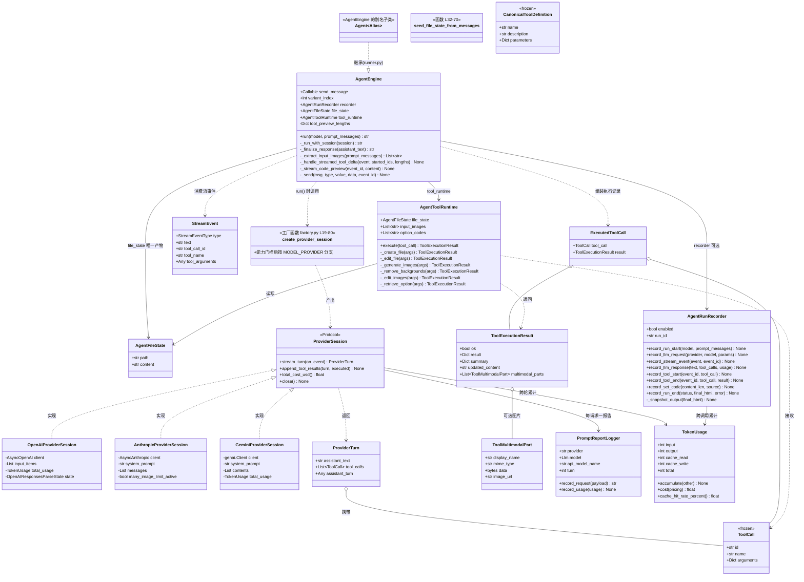
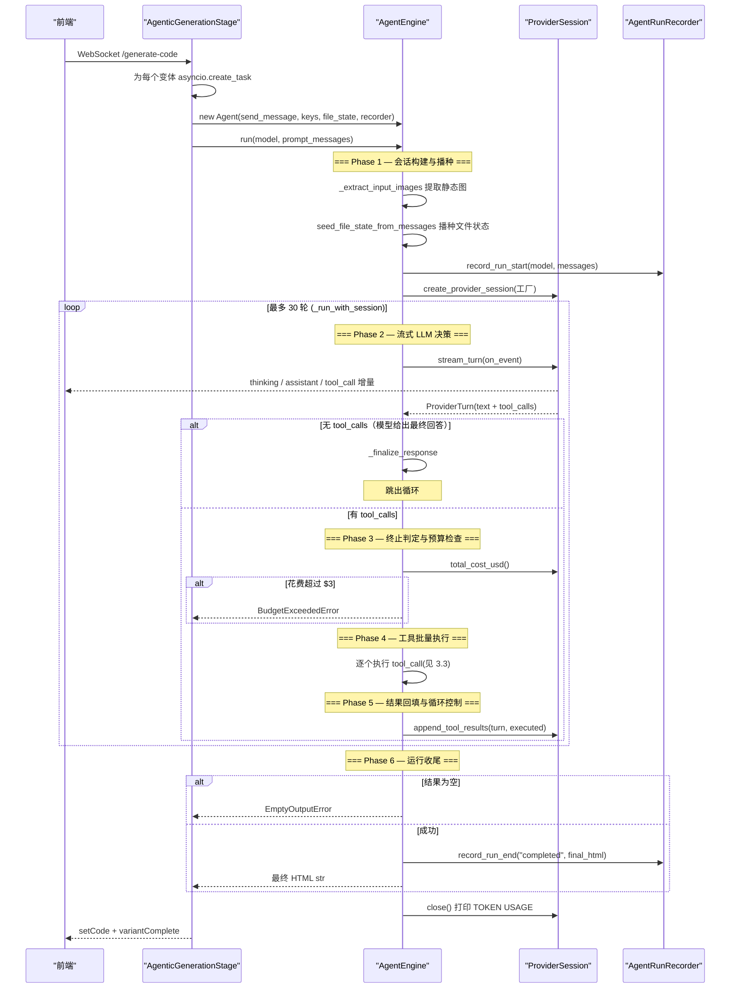
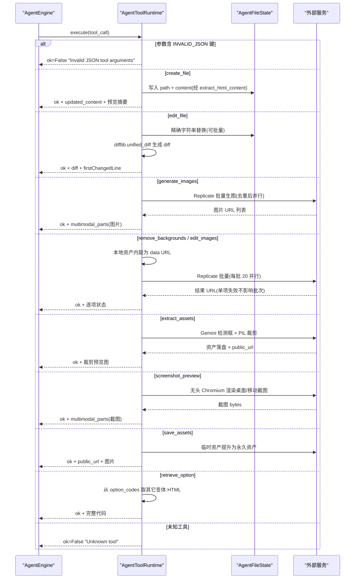
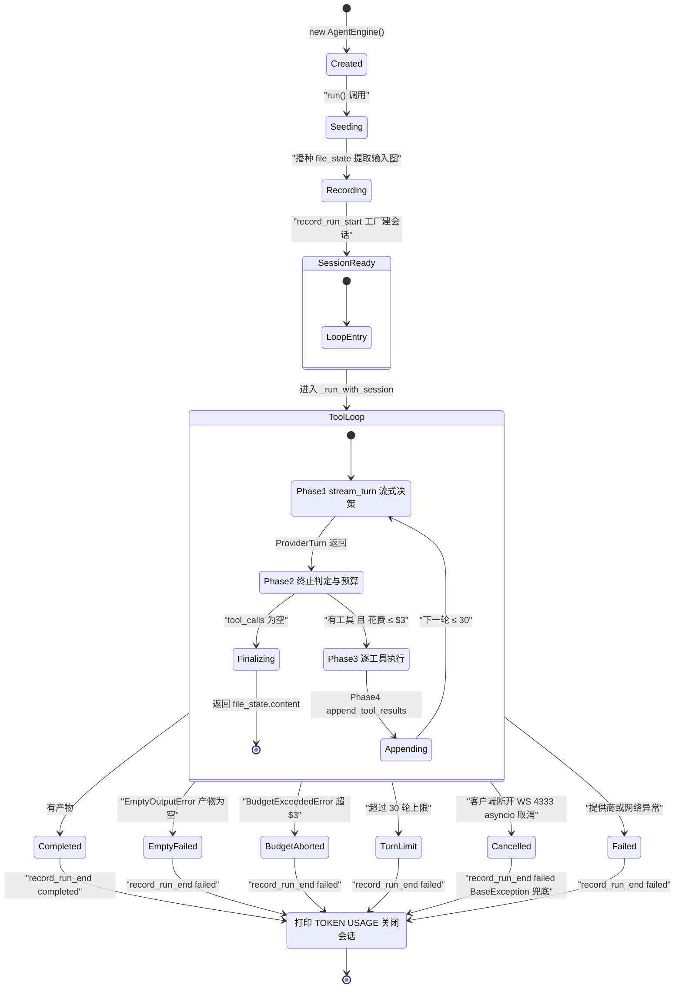
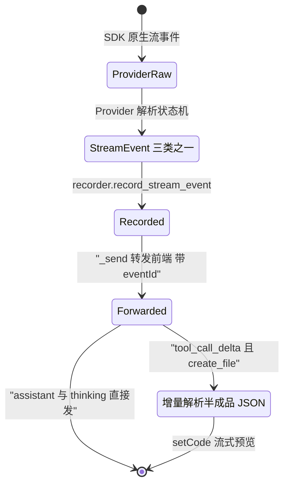

# Agent 运行逻辑分析

> 源码入口: `backend/agent/engine.py`（`AgentEngine` 类）
> 编排入口: `backend/routes/generate_code.py`（`AgenticGenerationStage._run_variant` 创建并驱动 Agent）
> 分析日期: 2026-09-24

---

## 1. 架构总览

📋 **一句话概括**: screenshot-to-code 的 Agent 是一个**提供商无关的流式工具循环引擎**——`AgentEngine` 以最多 30 轮的 ReAct 式循环驱动 `ProviderSession`（OpenAI/Anthropic/Gemini 三家统一抽象）进行流式决策，经 `AgentToolRuntime` 执行 9 种工具（写文件/编辑/抠图/生图/修图/截图自检等），以单一 `AgentFileState` 为唯一产物载体，全程由 `AgentRunRecorder` 落盘观测且带三重护栏（30 轮上限 / $3 预算熔断 / 空输出判失败）。

🎨 **核心设计原则**:

1. **提供商无关（Provider Agnostic）** — `ProviderSession` Protocol 统一三家 SDK；内部消息规范采用 OpenAI Chat 格式（`ChatCompletionMessageParam`），转换下放到各 Provider；工具定义先构建为厂商无关的 `CanonicalToolDefinition` 再各自序列化。
2. **流式优先（Streaming-First）** — 思考、正文、工具参数三类增量经统一 `StreamEvent` 事件流实时转发前端；`create_file` 的参数在**流式半成品 JSON** 阶段即被增量解析用于预览（`_extract_partial_json_string`）。
3. **产物单一状态（Single File State）** — Agent 的"世界状态"就是一个 `AgentFileState(path, content)`；工具写它、历史播种它、finalize 读它。
4. **护栏硬熔断（Hard Guardrails）** — 轮次上限 30、单变体花费上限 `GENERATION_MAX_COST_USD=$3.0`、空输出抛 `EmptyOutputError`。
5. **观测永不失败（Never-Fail Observability）** — `AgentRunRecorder`/`PromptReportLogger` 全部方法开关门控 + 自吞异常，记录器故障不可能打断生成。
6. **多路并行竞速（Variant Racing）** — 编排层同时跑 2-4 个不同模型的 Agent 实例（`asyncio.gather`），单路失败不拖累其它路。

📐 **架构模式识别**: ReAct（Reasoning + Action 交替）+ Tool-Use（结构化函数调用）+ 策略/工厂/协议（Provider 抽象）。无 Plan-Execute、无 Multi-Agent 协作；"环境"是虚拟的文件状态而非浏览器/DOM。

---

## 2. 类图



🎨 **类图说明**（阶段二细化后）:

- `Agent`(runner.py:4) 只是 `AgentEngine` 的空子类别名，保留兼容旧 import。
- `ProviderSession` 是 Python `typing.Protocol`（结构化接口，base.py:40-56），三家实现不显式继承也满足协议；每家各配一个**解析状态机**（`OpenAIResponsesParseState` / `AnthropicParseState` / `GeminiParseState`，详见各自职责文档）。
- `TokenUsage` 是计量叶子类：`input` 恒为净输入（OpenAI/Gemini 扣缓存），`cache_write` 仅 Anthropic；`cost()` 是预算熔断的计算基础，未定价模型经 `MODEL_PRICING` 查不到→`total_cost_usd()` 返回 None→熔断自动跳过。
- `AgentToolRuntime` 的三个外部工具实现（`run_extract_assets` / `run_screenshot_preview` / `run_save_assets`）与 Replicate 封装（`image_generation/*`）超出 3 层，已在《类的职责/AgentToolRuntime类职责.md》展开。
- 外围编排类（`AgenticGenerationStage`、`PipelineContext`、六层 `Middleware`）不在 Agent 核心类图内，见第 3.1 节时序图中的调用方。
- 📂 逐类方法级职责见 `类的职责/` 目录（9 篇）：AgentEngine、AgentFileState、AgentToolRuntime、ProviderSession（协议+工厂）、三家 ProviderSession、ToolCall（工具数据类型族）、AgentRunRecorder、PromptReportLogger+TokenUsage。

---

## 3. 核心运行流程 — 时序图

> 整个 run 生命周期划分为 6 个 Phase（与 `step内部流程/` 目录编号一致）：**1 会话构建与播种 → 2 流式 LLM 决策 → 3 终止判定与预算检查 → 4 工具批量执行 → 5 结果回填与循环控制 → 6 运行收尾**；其中 2-5 构成 ≤30 轮的循环体。

### 3.1 `AgentEngine.run()` 主循环时序图（含编排上下文）



### 3.2 单轮执行（`_run_with_session` 一次迭代）内部流程

> Phase 编号与 `step内部流程/` 目录对齐：Phase 1（会话构建）与 Phase 6（运行收尾）在循环外，此处展示循环内的 Phase 2-5。

```mermaid
sequenceDiagram
    participant Loop as "_run_with_session"
    participant Sink as "on_event 回调"
    participant Session as "ProviderSession"
    participant RT as "AgentToolRuntime"
    participant FE as "前端(WebSocket)"

    Note over Loop: === Phase 2 — 流式 LLM 决策 ===
    Loop->>Loop: 生成 assistant/thinking event_id
    Loop->>Sink: 定义 on_event 闭包
    Loop->>Session: stream_turn(on_event)
    Session->>Sink: assistant_delta(text)
    Sink->>FE: "assistant" 消息(带 event_id)
    Session->>Sink: thinking_delta(text)
    Sink->>FE: "thinking" 消息
    Session->>Sink: tool_call_delta(create_file 半成品参数)
    Sink->>Loop: _handle_streamed_tool_delta
    Loop->>FE: toolStart + setCode(增量预览)

    Note over Loop: === Phase 3 — 终止判定与预算检查 ===
    alt turn.tool_calls 为空
        Loop->>Loop: return _finalize_response(text)
    else 有工具调用且花费 > $3
        Loop-->>Loop: raise BudgetExceededError
    end

    Note over Loop: === Phase 4 — 工具批量执行 ===
    loop 每个 tool_call
        Loop->>FE: toolStart(name, 摘要输入)
        Loop->>RT: execute(tool_call)
        RT-->>Loop: ToolExecutionResult
        Loop->>FE: setCode(若 updated_content) + toolResult
    end

    Note over Loop: === Phase 5 — 结果回填与循环控制 ===
    Loop->>Session: append_tool_results(turn, executed_calls)
    Note over Loop: 进入下一轮 或 30 轮耗尽熔断
```

📂 每个 Phase 的逐步展开详见 `step内部流程/` 目录（6 个概述 + 15 个子步骤详解）。

### 3.3 动作（工具）执行流程 — `AgentToolRuntime.execute`



---

## 4. 状态图

### 4.1 Agent 生命周期状态图（run 级）



### 4.2 单轮内状态转换（一条 StreamEvent 的旅程）



📝 **无独立 Plan 状态机**: 本项目没有显式计划系统；"计划"隐含在模型的工具调用序列中（先 extract_assets → create_file → screenshot_preview → edit_file 是模型习得的常见序列，但引擎不做任何规划约束）。

---

## 5. 关键子系统详解

### 5.1 LLM 交互层（Provider 抽象）

- 🏗️ **协议**: `ProviderSession`（base.py:40-56）四个方法——`stream_turn`（一轮流式对话）、`append_tool_results`（回填工具结果继续会话）、`total_cost_usd`（预算查询，未定价模型返回 None）、`close`（收尾打印用量）。
- 🔄 **统一事件**: 三家 SDK 的原生流被各自的**解析状态机**归一为 `StreamEvent`:
  | Provider | 原生流 | 解析器 | 关键适配 |
  |---|---|---|---|
  | OpenAI | Responses API 事件流 | `parse_event`(openai.py:173-363) + `OpenAIResponsesParseState` | item_id↔call_id 双轨映射；reasoning summary delta/part 去重；strict schema 补 required/nullable；gpt-5.4 开 24h prompt cache |
  | Anthropic | messages.stream | `_parse_stream_event`(provider.py:209-270) + `AnthropicParseState` | adaptive thinking + effort 档位；>20 图自动降尺寸；cache_control ephemeral；错误 tool_result 只能纯文本 |
  | Gemini | generate_content_stream | `_parse_chunk`(gemini.py:244-292) + `GeminiParseState` | 保留原 model parts（thought signature 续传必需）；视频 Part 带 fps=10；公共 URL 图片需下载转 bytes |
- 💰 **计量归一**: `TokenUsage` 统一口径——OpenAI/Gemini 从 input 中扣除 cached；Gemini 把 thoughts 并入 output；Anthropic 单独记 cache_write。
- 🔧 **会话延续**: 三家各自维护原生会话容器（`_input_items` / `_messages` / `_contents`），`append_tool_results` 把 assistant 轮 + 工具结果写回；工具图片经 `ToolMultimodalPart` 以各家支持的方式注入（OpenAI: function_call_output 混排 input_image；Anthropic: tool_result 内容块；Gemini: FunctionResponse parts 内联 bytes）。

### 5.2 动作执行层（AgentToolRuntime）

- 🚦 **入口分发**: `execute`（runtime.py:56-99）先拦 `INVALID_JSON`（Provider 解析失败的参数原样带回让模型自纠错），再按 9 个工具名分发，未知工具返回友好错误而非抛异常。
- 📁 **文件工具**: `_create_file` 经 `extract_html_content` 剥离出纯 HTML 再入 `file_state`；`_edit_file` 支持单条/批量 `old_text→new_text` 精确替换（`count=-1` 全替换），失败即中止并返回未命中文本，成功附带 unified diff 与首个变更行号。
- 🖼️ **图片工具**: 全部走 Replicate；提示词/URL 先去重；每批 20 个 `asyncio.gather(return_exceptions=True)` 并行、单项失败不拖垮批次；本地资产 URL 先内联为 data URL（Replicate 取不到 localhost）。
- 👀 **多模态回看**: 生成的图片不只有 URL——`ToolMultimodalPart` 让模型直接"看到"工具产物（截图自检、素材裁剪、生图结果），其不变量在构造时强制校验（types.py:29-42：data/image_url 恰其一、禁 localhost URL）。

### 5.3 消息与上下文管理

- **规范格式**: 提示词输入为 OpenAI Chat 消息列表；Anthropic 拆出 system + 转换图片为 base64 块（provider.py:141-185）；Gemini 拆出 system_instruction + 转换为 `types.Content`（gemini.py:166-207，视频/图片分辨率分级）。
- **历史播种**: `seed_file_state_from_messages`（state.py:32-70）从最近的 assistant 历史提取 HTML 恢复文件状态；无历史时从 system 消息的 `"Here is the code of the app:"` 标记之后截取——这让 update 模式无需重传全部代码也能编辑。
- **无服务端会话**: 跨请求历史由前端持有回传（`history` + `fileState`），Agent 实例生命周期 = 一次 run。

### 5.4 循环防护（护栏子系统）

| 护栏 | 位置 | 触发 | 行为 |
|---|---|---|---|
| 轮次上限 | engine.py:219 `max_steps=30` | 循环耗尽 | `raise Exception("Agent exceeded max tool turns")` |
| 预算熔断 | engine.py:270-276 | 工具轮之间 `total_cost_usd() > $3.0` | `BudgetExceededError`（对外文案不含金额） |
| 空输出 | engine.py:356-357 | finalize 结果为空串 | `EmptyOutputError`（可重试的普通失败） |
| 参数自纠错 | runtime.py:57-66 | Provider 解析 JSON 失败 | 返回 `INVALID_JSON` 错误结果，模型下一轮重试 |
| 计时边界 | engine.py:296-299 | create_file 预览流之后 | 工具耗时只计执行、不计装饰性预览 |

### 5.5 观测子系统

- `AgentRunRecorder`（fs_logging/agent_runs.py，968 行）: 每变体一目录 `run_logs/{generation_id}/variant_{n}/`——`events.jsonl`（run_start/llm_call/stream_delta/tool_start/tool_end/set_code）+ `run.json` + `final.html` + `final_selfcontained.html`（易失 URL 即产即下载）+ SQLite `index.db` 索引。OpenAI 累积式 tool-args 只记增量防 O(n²)。
- `PromptReportLogger`（prompt_reports.py）: 每次 LLM 请求一个 JSON 报告（`PROMPT_REPORTS_ENABLED` 门控），前端 `/evals/prompt-reports` 可查。
- 两者所有方法**先查开关、再自吞异常**——记录器永远不能让生成失败。

---

## 6. 错误处理策略

| 异常/错误 | 抛出位置 | 处理方式 | 用户可见结果 |
|---|---|---|---|
| `EmptyOutputError` | engine.py:357 | 按 run 失败记录，可被上层重试（eval runner 重试 2 次但不重试 Budget） | variantError |
| `BudgetExceededError` | engine.py:276 | 中止该变体；eval 中**不重试** | "exceeded its resource limit" |
| `Exception("Agent exceeded max tool turns")` | engine.py:327 | 常规失败 | variantError |
| `openai.AuthenticationError` | SDK | `_run_variant` 捕获翻译（generate_code.py:669-681） | 引导检查 key 文案 |
| `openai.NotFoundError` | SDK | 同上（:682-696） | 引导 Troubleshooting.md |
| `openai.RateLimitError` | SDK | 同上（:697-708） | 配额超限文案 |
| `INVALID_JSON` 工具参数 | openai.py:387 / anthropic.py:286 | 包成 `{"INVALID_JSON": raw}` 传给 runtime | 模型收到错误结果自行重试 |
| 工具内错误（Replicate 单项失败等） | runtime.py 各处 | `ok=False` 或逐项 `status:"error"`，不抛异常 | 模型看到失败项决定重试/跳过 |
| `WebSocketDisconnect` / 连接关闭 | WebSocketCommunicator | `is_closed=True` 后静默丢弃消息（generate_code.py:203-210） | 前端已离开，无感知 |
| 客户端取消（asyncio Cancelled） | engine.py:363 `except BaseException` | 仍落盘 `record_run_end("failed")` 再 re-raise | run 记录不悬挂在 running |
| 记录器自身异常 | agent_runs.py 全方法 | 自吞 | 无影响 |

🛑 **终止条件汇总**: ① 模型不再调用工具（正常完成）；② 30 轮耗尽；③ 预算超限；④ 空输出；⑤ 客户端断开/取消；⑥ 提供商不可恢复错误。

---

## 7. 初始化流程

```
AgentEngine.__init__()  (engine.py:52-97)
  ├── 存储 sendMessage 回调与 variant_index          # 向前端发消息的通道
  ├── 存储 4 个 API key + 功能开关
  │     ├── openai_api_key / openai_base_url
  │     ├── anthropic_api_key / gemini_api_key / replicate_api_key
  │     └── should_generate_images / should_extract_assets / asset_base_url
  ├── AgentFileState()
  │     └── 若 initial_file_state 有内容 → 播种 path(默认 index.html) + content
  ├── AgentToolRuntime(file_state, keys, asset_base_url, option_codes)
  │     └── 持有 input_images=[]（run() 时再注入）
  └── _tool_preview_lengths = {}                     # create_file 预览去重记账

run() 前置  (engine.py:329-353)
  ├── tool_runtime.input_images = _extract_input_images(prompt_messages)
  │     └── 只放行 data:image/ 前缀的静态图（视频复用 image_url 形态但被排除）
  ├── seed_file_state_from_messages(file_state, prompt_messages)
  ├── recorder.record_run_start(model, prompt_messages)
  └── create_provider_session(...)  (工厂, factory.py:19-80)
        ├── canonical_tool_definitions(能力门控)   # 4 个开关决定 9 工具中哪些可见
        ├── model ∈ OPENAI_MODELS   → AsyncOpenAI + OpenAIProviderSession
        ├── model ∈ ANTHROPIC_MODELS → AsyncAnthropic + AnthropicProviderSession
        └── model ∈ GEMINI_MODELS   → genai.Client + GeminiProviderSession
```

---

## 8. 控制流 — 取消与熔断

⚠️ 本项目**没有 pause/resume 机制**（无中途暂停后继续的语义）；控制流只有「取消」与「熔断」两种提前终止：

```
正常路径
─────────────────────────────────────────────
Stage._run_variant ──await──▶ Agent.run ──▶ 循环 30 轮内自然完成
      ▲
      │ variantComplete + setCode
      ▼

取消路径（用户关页面 / 点 Stop）
─────────────────────────────────────────────
前端 ws.close(4333) ──▶ WebSocketCommunicator.is_closed = True
      │                        │
      │  发送侧：后续 _send 静默丢弃（不抛错）
      │
      └─▶ asyncio 取消 task ──▶ CancelledError 进入 run()
                 │
                 └─▶ except BaseException (engine.py:363)
                        ├── recorder.record_run_end("failed")   # 落盘不悬挂
                        └── raise（finally 中 session.close()）

熔断路径
─────────────────────────────────────────────
轮内工具执行完毕 ──▶ spent = session.total_cost_usd()
      │
      ├─ spent is None ──▶ 未定价模型，不设限，继续
      ├─ spent ≤ $3.0    ──▶ append_tool_results，进入下一轮
      └─ spent > $3.0    ──▶ print [BUDGET] + raise BudgetExceededError
                                │
                                └─▶ _run_variant except → variantError 给前端
                                    （eval runner 捕获后不重试）
```

📝 设计要点: 预算检查**只发生在"还要继续"的轮次**——若模型本轮已给出最终答案（无工具调用），先走 finalize 正常返回，因为那一轮已经付费（engine.py:267-269 注释明言）。

---

## 9. 关键数据流

```
提示词消息 (List[ChatCompletionMessageParam])
     │
     ▼
┌──────────────────┐   工厂+能力门控    ┌────────────────────────┐
│ AgentEngine.run  │───────────────▶│ ProviderSession (三选一) │
└────────┬─────────┘                 └───────────┬────────────┘
         │ 播种                                  │ stream_turn 流
         ▼                                      ▼
┌──────────────────┐   StreamEvent 增量   ┌──────────────────────┐
│ AgentFileState   │◀──── tool_call ────│ 前端 WebSocket 消息    │
│ (path, content)  │      半成品预览      │ thinking/assistant/   │
└────────▲─────────┘                     │ setCode/toolStart/... │
         │ updated_content               └──────────────────────┘
┌────────┴─────────┐   execute(ToolCall)
│ AgentToolRuntime │◀──────────────────────────────────┐
└────────┬─────────┘                                    │
         │ ToolExecutionResult                          │
         │ (ok/result/summary/updated_content/          │
         │  multimodal_parts 图片)                      │
         ▼                                              │
┌──────────────────┐  append_tool_results  ┌────────────┴───────┐
│ 外部服务          │◀─────────────────────│ ProviderSession 会话 │
│ Replicate/Gemini │   工具图片按家注入     │ (续轮上下文)        │
│ Chromium/磁盘    │                      └────────────────────┘
└──────────────────┘
         │
         ▼  全程旁路（永不失败）
┌────────────────────────────────────┐
│ AgentRunRecorder → run_logs/       │
│ events.jsonl + SQLite + final.html │
└────────────────────────────────────┘

最终产物: run() 返回 file_state.content (完整 HTML 单文件)
```

📊 **数据流要点**:

- `AgentFileState` 是所有写操作的汇聚点（create_file/edit_file 写，retrieve_option/save_assets 读外部代码），也是 `run()` 的返回源。
- `StreamEvent`（引擎内部）与前端 WebSocket 消息（`MessageType`）是两层不同协议，`on_event` 闭包 + `_send` 完成翻译。
- `ToolExecutionResult.multimodal_parts` 是"工具→模型视觉反馈"的关键回路：没有它，截图自检工具就只是返回文字描述。

---

## 📋 总结对比表

| 维度 | 本项目实现 | 位置 |
|------|-----------|------|
| 主入口 | `AgentEngine.run(model, prompt_messages)` | engine.py:329 |
| 主循环 | `_run_with_session` for 循环 ≤30 轮 | engine.py:218-327 |
| 单步 = | 一轮 LLM 流式决策 + 工具批执行 + 结果回填 | engine.py:262-325 |
| 动作执行 | `AgentToolRuntime.execute` 9 工具分发 | runtime.py:56-99 |
| LLM 交互 | `ProviderSession` Protocol 三实现 | providers/ |
| 世界状态 | `AgentFileState` 单文件 | state.py:9 |
| 循环防护 | 30 轮 + $3 预算 + 空输出三重护栏 | engine.py:219/270/357 |
| 暂停/恢复 | **无**（仅取消与熔断） | engine.py:363 |
| 观测 | Recorder/PromptReport 全程旁路自吞异常 | fs_logging/ |
| 多路并行 | 编排层 2-4 变体 asyncio.gather 竞速 | generate_code.py:589-611 |

> 🔗 后续阶段: 阶段二将细化各类的职责文档（`类的职责/`），阶段三将按 Phase 展开 `_run_with_session` 每个子步骤的详细流程（`step内部流程/`）。
