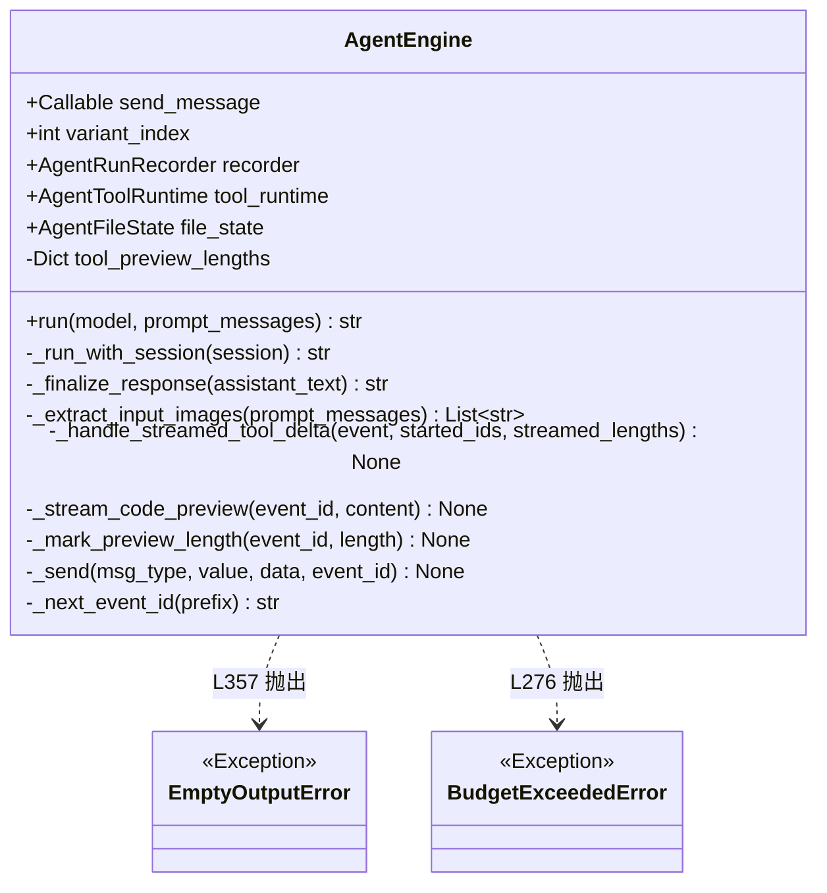
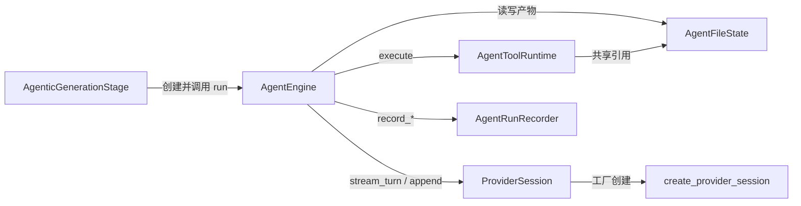

# `AgentEngine` 类职责分析

> 源码位置: `backend/agent/engine.py`（别名子类 `Agent` 见 `backend/agent/runner.py:4`）

---

## 📋 **类作用**

Agent 的**心脏**：以最多 30 轮的 ReAct 式循环驱动提供商会话流式决策，调度工具运行时执行动作，把护栏（预算/轮次/空输出）与流式前端反馈（thinking/assistant/setCode）编织进每一次迭代，最终产出单文件 HTML。

---

## 🏗️ **类定义**



### 属性

| 属性 | 类型 | 访问 | 说明 |
|------|------|------|------|
| `send_message` | `Callable` | public | 向前端发 WebSocket 消息的异步回调（5 参数） |
| `variant_index` | `int` | public | 变体编号（0-3），消息路由与 eventId 都带它 |
| `recorder` | `AgentRunRecorder` | public | 运行记录器，可为 None（eval 无前端场景仍记录） |
| `file_state` | `AgentFileState` | public | 唯一产物载体（path + content） |
| `tool_runtime` | `AgentToolRuntime` | public | 工具执行器，与 file_state 共享引用 |
| `_tool_preview_lengths` | `Dict[str, int]` | private | 每个 tool eventId 已发预览的长度记账（去重） |

### 方法

| 方法 | 参数 | 返回值 | 说明 |
|------|------|--------|------|
| `run()` | `model: Llm, prompt_messages` | `str` | 总入口：播种→建会话→循环→收尾（L329-373） |
| `_run_with_session()` | `session: ProviderSession` | `str` | 30 轮工具主循环（L218-327） |
| `_finalize_response()` | `assistant_text: str` | `str` | 无工具调用时的兜底收尾（L375-386） |
| `_extract_input_images()` | `prompt_messages` | `List[str]` | 静态方法，只放行 data:image/ 数据 URL（L99-125） |
| `_handle_streamed_tool_delta()` | `event, started_ids, lengths` | `None` | create_file 流式半成品预览（L170-216） |
| `_stream_code_preview()` | `event_id, content` | `None` | 工具完成后的平滑分块回放（L146-168） |
| `_send()` | `msg_type, value, data, event_id` | `None` | send_message 的薄封装，自动带 variant_index（L130-137） |

---

## 🔍 **核心方法详解**

### `run()`（第 329-373 行）

**作用**: 一次变体生成的完整生命周期。

**逻辑流程：**
```
run(model, prompt_messages)
  │
  ├── 前置注入
  │     ├── tool_runtime.input_images = _extract_input_images(...)
  │     │     └── 只收 data:image/ 且含 "," 的（视频复用 image_url 形态但被拒）
  │     └── seed_file_state_from_messages(file_state, prompt_messages)
  │           └── 已有 content 则跳过（update 场景由 initial_file_state 播种）
  │
  ├── recorder.record_run_start(model, prompt_messages)
  ├── session = create_provider_session(...)   # 工厂 + 能力门控
  │
  ├── try: result = await _run_with_session(session)
  │     ├── result 为空 → raise EmptyOutputError
  │     └── record_run_end("completed", final_html=result)
  │
  ├── except BaseException as exc:             # 含取消(CancelledError)
  │     └── record_run_end("failed", error=...) → raise
  │
  └── finally: await session.close()           # 打印 TOKEN USAGE
```

**关键代码：**
```python
# engine.py:354-373
try:
    result = await self._run_with_session(session)
    if not result:
        raise EmptyOutputError()          # 跑完却没产物 → 可重试失败
    ...
except BaseException as exc:             # 关键：BaseException 而非 Exception
    # 客户端断开(asyncio 取消)也落盘 run 记录，不悬挂在 running
    ...
finally:
    await session.close()
```

**设计要点：**
- 用 `BaseException` 捕获是刻意的——`CancelledError` 不是 `Exception` 子类，普通 except 会漏掉取消场景导致 run.json 永远停在 running。
- `input_images` 注入晚于构造，是因为提取依赖 prompt_messages（run 时才有）。

---

### `_run_with_session()`（第 218-327 行）

**作用**: ≤30 轮的流式决策-执行-回填循环。

**逻辑流程：**
```
for _ in range(max_steps=30):
  │
  ├── 定义 on_event 闭包（每轮新建 eventId）
  │     ├── assistant_delta → recorder + _send("assistant")
  │     ├── thinking_delta  → recorder + _send("thinking")
  │     └── tool_call_delta → _handle_streamed_tool_delta（流式预览）
  │
  ├── turn = await session.stream_turn(on_event)
  │
  ├── turn.tool_calls 为空？
  │     └── Yes → return await _finalize_response(turn.assistant_text)
  │
  ├── 预算检查（仅"还要继续"时）
  │     ├── spent = session.total_cost_usd()
  │     ├── None（未定价） → 跳过
  │     └── spent > $3.0   → raise BudgetExceededError
  │
  ├── for tool_call in turn.tool_calls:
  │     ├── 未流式预告过 → _send("toolStart", 摘要输入)
  │     ├── create_file 且有 content → _stream_code_preview
  │     ├── recorder.record_tool_start
  │     ├── result = await tool_runtime.execute(tool_call)
  │     ├── recorder.record_tool_end
  │     ├── result.updated_content → _send("setCode")
  │     └── _send("toolResult", 摘要 + ok)
  │
  └── await session.append_tool_results(turn, executed)
else: raise Exception("Agent exceeded max tool turns")
```

**关键代码：**
```python
# engine.py:267-276 —— 预算检查的边界设计
# Abort only when the run would otherwise continue: a run that
# just produced its final answer is already paid for.
spent = session.total_cost_usd()
if spent is not None and spent > GENERATION_MAX_COST_USD:
    raise BudgetExceededError()
```

**设计要点：**
- 检查点放在"无工具调用判定"**之后**——最终轮已付费，不再拦截（注释明言）。
- 工具计时从 `_stream_code_preview` 之后才开始（L296-299），装饰性预览不计入工具耗时。
- `started_tool_ids`/`streamed_lengths` 每轮重建：流式预告与正式执行共用同一 tool_call_id 作 eventId，避免前端重复渲染。

---

### `_handle_streamed_tool_delta()`（第 170-216 行）

**作用**: 在工具参数还在流式累积时，就把 create_file 的半成品内容推给前端。

**逻辑流程：**
```
tool_call_delta 事件（仅 create_file）
  │
  ├── content = extract_content_from_args(event.tool_arguments)
  │     └── 半成品 JSON 增量解析（见 parsing.py 职责文档）
  │
  ├── 首次见到该 tool_call_id？
  │     └── 发 toolStart(path, contentLength, preview)
  │
  └── 发 setCode 时机
        ├── 首次有内容（last_len==0）→ 立即发
        └── 增量 ≥ 40 字符 → 发（节流）
```

**设计要点：**
- 40 字符的节流阈值是体验与消息量的折中——每 delta 都发会淹没 WebSocket。
- Gemini 的 `tool_arguments` 是 dict（SDK 已解析），OpenAI/Anthropic 是累积 JSON 字符串——`extract_content_from_args` 两种都处理。

---

### `_finalize_response()`（第 375-386 行）

**作用**: 模型不调工具直接给答案时的收尾。

```python
# engine.py:375-386
if self.file_state.content:
    return self.file_state.content        # 工具已写过 → 直接用
html = extract_html_content(assistant_text)  # 从正文剥 HTML
if html:
    self.file_state.content = html
    await self._send("setCode", html)     # 补发给前端
```

**设计要点：** 优先信 `file_state`（工具产物），正文 HTML 只是兜底——防止模型把代码写在正文里却没调 create_file 时丢结果。

---

## 🎨 **设计亮点**

1. **模板方法变体**: 主循环结构固定（决策→判定→执行→回填），但决策细节完全委托 ProviderSession、执行细节完全委托 AgentToolRuntime——引擎只管编排与护栏。
2. **流式三通道**: thinking/assistant/tool_call 三类增量各有独立 eventId 前缀（`assistant-{variant}-{hex}`），前端可分别累积渲染。
3. **护栏内联化**: 预算/轮次/空输出三道护栏直接织入循环而非独立层——任何一处遗漏都不可能绕过。
4. **失败可观测**: 即使取消也闭环记录（BaseException 捕获），评测系统的 diff 模式依赖这一点判断 run 终态。

---

## 🔗 **与其他类的协作**



| 协作类 | 关系 | 协作方式 |
|--------|------|---------|
| `AgenticGenerationStage` | 调用方 | `_run_variant` 构造并 await `run()`（generate_code.py:643-658） |
| `ProviderSession` | 依赖 | 每轮 `stream_turn` 决策、`append_tool_results` 续轮、`total_cost_usd` 预算、`close` 收尾 |
| `AgentToolRuntime` | 组合 | Phase 3 逐工具执行 |
| `AgentFileState` | 组合 | 唯一产物；与 runtime 共享同一实例 |
| `AgentRunRecorder` | 组合(可空) | 全生命周期事件落盘 |

---

## 📊 **生命周期**

- **创建时机**: 每个变体一次——`AgenticGenerationStage._run_variant`（WebSocket 路径）或 `evals/core.py`（评测路径）。
- **使用场景**: 恰好一次 `run()` 调用；实例不可复用（`_ended` 状态在 recorder 侧防重复收尾）。
- **销毁时机**: `run()` 返回或抛出即废弃，由 GC 回收；`session.close()` 在 finally 中保证网络资源释放。
