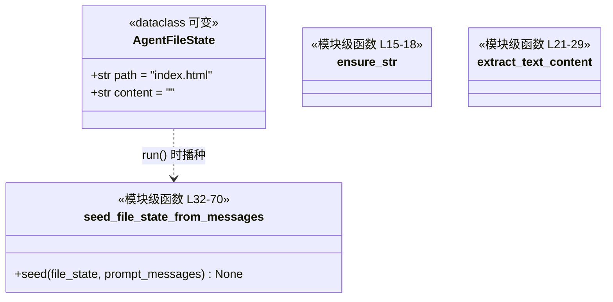

# `AgentFileState` 类职责分析

> 源码位置: `backend/agent/state.py`（全文 70 行）

---

## 📋 **类作用**

Agent 的**全部世界状态**：一个两字段数据类表示"当前主文件"。所有写工具（create_file/edit_file）写它，截图自检读它，`run()` 的返回值取自它——把多轮交互收敛为单一可变产物。

---

## 🏗️ **类定义**



### 属性

| 属性 | 类型 | 访问 | 说明 |
|------|------|------|------|
| `path` | `str` | public | 主文件路径，默认 `index.html`；供前端编辑器定位与 diff 标注 |
| `content` | `str` | public | 当前完整 HTML（经 `extract_html_content` 剥离后的纯 HTML） |

### 方法（模块级函数）

| 函数 | 参数 | 返回值 | 说明 |
|------|------|--------|------|
| `seed_file_state_from_messages()` | `file_state, prompt_messages` | `None` | 从对话历史恢复文件状态（L32-70） |
| `extract_text_content()` | `message` | `str` | 从 OpenAI 消息取文本（str 或分段列表，L21-29） |
| `ensure_str()` | `value` | `str` | None→"" 的强转工具（L15-18） |

---

## 🔍 **核心方法详解**

### `seed_file_state_from_messages()`（第 32-70 行）

**作用**: 在 `run()` 开始时，把"上一次的代码"恢复进 file_state，让 update 模式有底稿可编辑。

**逻辑流程：**
```
seed_file_state_from_messages(file_state, messages)
  │
  ├── file_state.content 非空？
  │     └── Yes → 直接返回（initial_file_state 已在构造时播种）
  │
  ├── 路径 1：倒序找最近的 assistant 消息
  │     ├── 提取文本 → extract_html_content 剥离
  │     └── 有 HTML 或原文 → 写入 content，return
  │
  └── 路径 2：无 assistant 历史 → 检查 system 消息
        ├── 找标记 "Here is the code of the app:"
        └── 标记之后的文本 → 剥离 → 写入 content
```

**关键代码：**
```python
# state.py:59-70 —— system 消息标记截取
markers = ["Here is the code of the app:"]
for marker in markers:
    if marker not in system_text:
        continue
    raw_text = system_text.split(marker, 1)[1].strip()  # 标记之后全算代码
    extracted = extract_html_content(raw_text)
    file_state.content = extracted or raw_text
```

**设计要点：**
- 双路径覆盖两种 update 形态：多轮对话（assistant 历史里有代码）与"快照+指令"（代码嵌在 system 提示里，由 `prompts/update/from_file_snapshot.py` 构造）。
- `extracted or raw_text`：剥不出 HTML 就原文接受——宁可内容多也不能为空（空会被 `EmptyOutputError` 判死）。

---

## 🎨 **设计亮点**

1. **极简状态模型**: 对比 browser-use 的 BrowserStateHistory（DOM 树/截图/URL 多维状态），本项目把"环境"压缩为单文件字符串——因为产物本身就是单文件 HTML。
2. **共享可变引用**: AgentEngine 与 AgentToolRuntime 持有**同一个** AgentFileState 实例，工具写入即刻对引擎可见（`updated_content` 字段只是冗余直通）。
3. **播种优先级链**: initial_file_state（前端快照）> assistant 历史 > system 标记 > 空——四级兜底保证 update 场景尽量有底稿。

---

## 🔗 **与其他类的协作**

| 协作类 | 关系 | 协作方式 |
|--------|------|---------|
| `AgentEngine` | 组合 | 构造创建；`run()` 播种；`_finalize_response` 读取返回 |
| `AgentToolRuntime` | 共享引用 | `_create_file`/`_edit_file` 写入；`run_screenshot_preview` 读取 |
| `codegen/utils.extract_html_content` | 依赖 | 播种与写入时剥离纯 HTML |
| `prompts/update/*` | 数据源 | system 消息里的 "Here is the code of the app:" 标记由提示词管线生成 |

---

## 📊 **生命周期**

- **创建时机**: `AgentEngine.__init__`（engine.py:82）。
- **使用场景**: 整个 run 期间被读写；`content` 从空 → 播种 → 工具迭代更新 → 最终定格。
- **销毁时机**: 随 AgentEngine 一起废弃；最终 content 经 `run()` 返回后进入前端/eval 输出。
