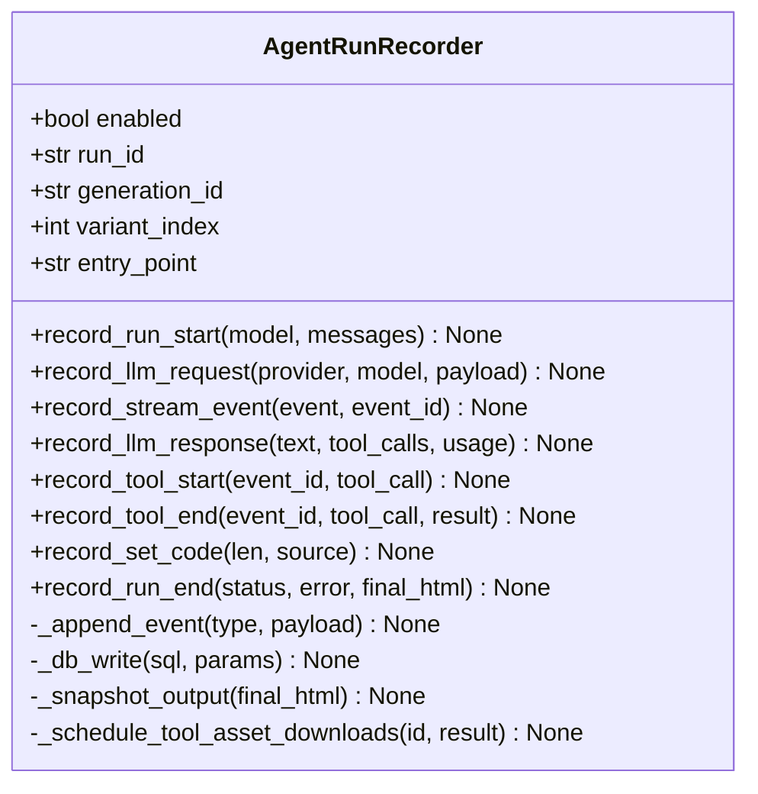

# `AgentRunRecorder` 类职责分析

> 源码位置: `backend/fs_logging/agent_runs.py`（968 行）

---

## 📋 **类作用**

一次 Agent 运行的**全量旁路记录器**：每个变体一个 `run_{时间戳}_{hex}` 目录，落盘 events.jsonl（每个流增量/工具/LLM 调用）+ run.json（汇总）+ final.html + 自包含快照 + SQLite 索引；replicate.delivery 等易失 URL 即产即下载。铁律：**记录永不打断生成**（全方法开关门控 + 自吞异常）。

---

## 🏗️ **类定义**



### 落盘布局（模块 docstring L11-19）

```
{LOGS_PATH}/run_logs/agent_runs/
  {run_id}/events.jsonl             逐事件追加（seq + ts_ms）
  {run_id}/run.json                 终态汇总（含每次调用摘要）
  {run_id}/final.html               最终产物原文
  {run_id}/final_selfcontained.html 资源引用重写为 assets/ 的独立版
  {run_id}/assets/ + assets_manifest.json
  {run_id}/tool_assets/             易失工具产物即时下载
  index.db                          SQLite: runs/llm_calls/eval_sessions*
```

### 属性（构造 L244-302）

| 属性 | 说明 |
|------|------|
| `enabled` | 默认取 `PROMPT_REPORTS_ENABLED`，可显式覆盖（测试用） |
| `run_id` | `run_YYYYmmdd_HHMMSS_{hex8}`，目录名与主键 |
| `_seq/_step` | 事件序号 / LLM 调用轮次 |
| `_tool_args_progress` | **OpenAI 累积式参数的增量记账**（防 O(n²)） |
| `_tool_asset_tasks` | 后台下载任务列表，run_end 时统一 gather |

---

## 🔍 **核心方法详解**

### `record_stream_event()`（第 427-468 行）

**作用**: 每个流增量的落盘，含 OpenAI 累积参数的差量化。

**关键代码：**
```python
# agent_runs.py:451-456 —— O(n²) 防御
# OpenAI streams *cumulative* argument snapshots; record only
# the unseen suffix so the JSONL replays without O(n^2) bloat.
key = event.tool_call_id or "unknown"
seen = self._tool_args_progress.get(key, 0)
delta = args_text[seen:] if len(args_text) > seen else ""
self._tool_args_progress[key] = max(seen, len(args_text))
```

**设计要点：** Anthropic/Gemini 给增量、OpenAI 给全量快照——记录器按"已见长度"做差分，events.jsonl 重放时语义三家一致。

---

### `record_llm_response()`（第 470-566 行）

**作用**: 一轮 LLM 调用的终态：耗时、思考时长、首增量时延、用量与成本，双写 events.jsonl 与 SQLite llm_calls 表。

**指标口径：**
```
duration_ms            = 本轮起止
thinking_ms            = last_thinking - first_thinking（思考区间）
time_to_first_delta_ms = 首个任意增量 - 本轮开始   ← 用户体感指标
cost_usd               = usage.cost(pricing)；未定价 → has_unpriced_calls=True
```

---

### `record_run_end()`（第 726-838 行）

**逻辑流程：**
```
record_run_end(status, error, final_html)
  │
  ├── enabled 为假或已结束 → return（幂等防重）
  ├── await gather(后台资产下载任务)     # 易失 URL 抢救
  ├── final_html 有值 → _snapshot_output
  ├── 追加 run_end 事件 + 写 run.json
  ├── os.walk 统计目录大小
  └── UPDATE runs SET 终态/时长/用量/成本 WHERE run_id
```

**设计要点：** `_ended` 标志保证引擎的 BaseException 兜底与正常路径不会双写；`total_cost_usd` 只在 `num_priced_calls>0` 时给出——全未定价时存 None 而非误导性的 0。

---

### `_snapshot_output()`（第 842-968 行）

**作用**: 把最终 HTML 变成**自包含**运行档案。

**逻辑流程：**
```
1. 写 final.html 原文
2. 本地资产: /local-assets/ 正则扫出 → 从 LOCAL_ASSET_DIR 复制进 assets/
     └── 同文件多 URL 形态（带/不带 host）只复制一次，多形态都重写
3. 远程图片: src/srcset/href/CSS url() 位置扫描
     ├── 图片扩展名 或 replicate.delivery → 下载
     └── 易失域再全文扫一遍（JS 字符串里的 URL 也抓）
4. 替换规则按 URL 长度降序应用 → final_selfcontained.html
5. assets_manifest.json 记录每 URL 的捕获状态
```

**设计要点：** "长 URL 先替换"防裸路径误伤全 URL 的中段——细节决定快照可回放性。

---

### `_schedule_tool_asset_downloads()`（第 645-682 行）

**作用**: 工具产出 replicate.delivery URL 的**即时**后台下载（不等 run 结束——那时可能已过期）。

- fire-and-forget：`loop.create_task` 不阻塞生成；run_end 前统一收割。
- 无事件循环（同步测试调用）时静默跳过（`except RuntimeError`）。

---

## 🎨 **设计亮点**

1. **永不失败哲学**: 每个公开方法开头 `if not self.enabled: return` + 整体 try/except 打印——观测系统的故障域被压缩到 print。
2. **SQLite 轻索引 + JSONL 全量**: 索引支撑前端列表/矩阵查询（routes/agent_runs.py、eval_sets 的 matrix），JSONL 支撑逐事件重放——读写分工。
3. **手工 ALTER 迁移**（`_migrate_runs_table` L157-175）: `CREATE TABLE IF NOT EXISTS` 不改已存表，新列靠 PRAGMA 探测后补——无迁移框架的务实解。
4. **去重逻辑复制而非 import**: `_first_input_image_sha256`（L194-226）复制了引擎的提取逻辑——因为引擎 import 本模块，反向 import 会成环（注释明言）。

---

## 🔗 **与其他类的协作**

| 协作方 | 关系 | 协作方式 |
|--------|------|---------|
| `AgentEngine` | 持有者 | 9 个 record_* 钩子全程调用 |
| 三个 ProviderSession | 调用者 | record_llm_request/response |
| `routes/agent_runs.py` | 消费者 | GET 列表/重放/清理 API |
| `evals/sessions.py` | 消费者 | runs 表按 input_image_sha256 匹配评测矩阵 |
| `PromptReportLogger` | 同伴 | 共享 to_serializable 与 LOGS_PATH 约定 |

---

## 📊 **生命周期**

- **创建时机**: 编排层每变体一个（generate_code.py:635-642 / evals/core.py）。
- **使用场景**: run_start → (llm_request ↔ stream_event* ↔ llm_response ↔ tool_start/end)* → run_end。
- **销毁时机**: run_end 后即静态档案；实例本身随引擎废弃。
