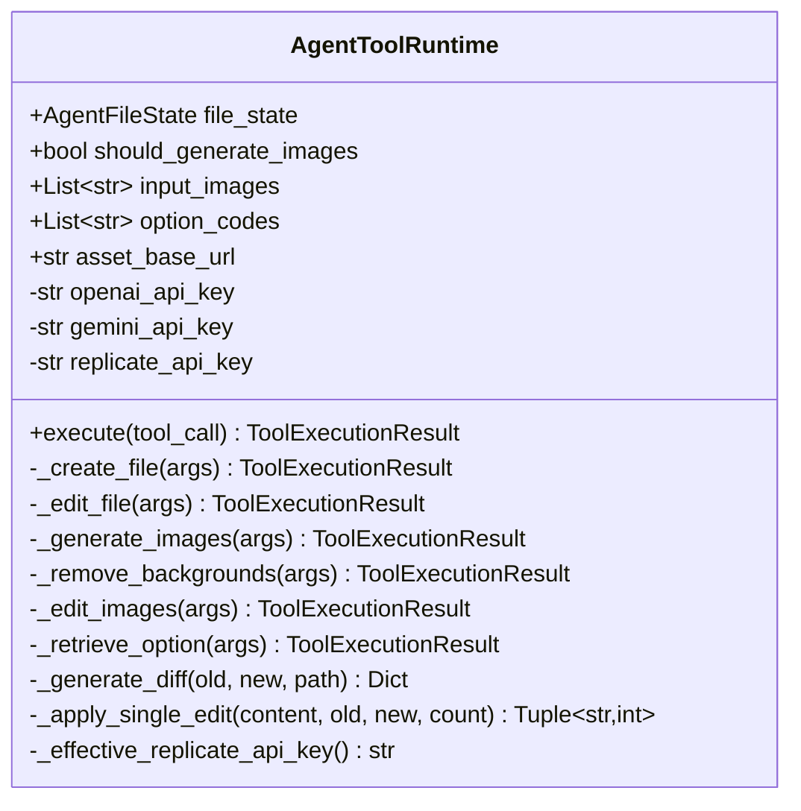
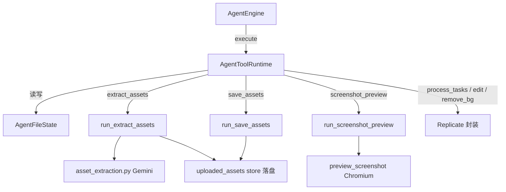

# `AgentToolRuntime` 类职责分析

> 源码位置: `backend/agent/tools/runtime.py`（兼容别名 `AgentToolbox` 见 L589）
> 工具定义: `backend/agent/tools/definitions.py`；工具实现散布于 extract_assets.py / screenshot_preview.py / uploaded_assets/tools.py

---

## 📋 **类作用**

动作执行层：把模型决策出的 `ToolCall` 安全地分发给 9 个工具实现，统一返回 `ToolExecutionResult`。所有错误（缺 key、参数坏、单项失败）都转为 `ok=False` 的正常返回——**工具层永不抛异常打断循环**。

---

## 🏗️ **类定义**



### 属性

| 属性 | 类型 | 访问 | 说明 |
|------|------|------|------|
| `file_state` | `AgentFileState` | public | 与引擎共享的产物引用 |
| `input_images` | `List[str]` | public | run() 时注入的静态输入图（extract_assets 的原料） |
| `option_codes` | `List[str]` | public | 其它变体的完整 HTML（retrieve_option 的数据源） |
| `should_generate_images` | `bool` | public | 图片生成功能开关 |
| `asset_base_url` / `user_id` | `str` | public | 素材服务地址 / 托管版用户钩子 |
| 3 个 API key | `Optional[str]` | public | OpenAI/Gemini/Replicate（Replicate 可回退 env） |

### 方法

| 方法 | 参数 | 返回值 | 说明 |
|------|------|--------|------|
| `execute()` | `tool_call: ToolCall` | `ToolExecutionResult` | 入口分发：INVALID_JSON 拦截 → 9 工具 switch（L56-99） |
| `_create_file()` | `args` | `ToolExecutionResult` | 写完整文件（L101-132） |
| `_edit_file()` | `args` | `ToolExecutionResult` | 精确替换编辑 + diff（L180-257） |
| `_generate_images()` | `args` | `ToolExecutionResult` | Replicate 批量生图（L259-322） |
| `_remove_backgrounds()` | `args` | `ToolExecutionResult` | 批量去背景（L324-400） |
| `_edit_images()` | `args` | `ToolExecutionResult` | 批量图片编辑（L402-522） |
| `_retrieve_option()` | `args` | `ToolExecutionResult` | 取其它变体代码（L524-585） |

---

## 🔍 **核心方法详解**

### `execute()`（第 56-99 行）

**作用**: 唯一入口；两层防御后按名分发。

**逻辑流程：**
```
execute(tool_call)
  │
  ├── "INVALID_JSON" in arguments？
  │     └── Yes → ok=False，把原始文本带回（模型下轮自纠错）
  │
  ├── 按名分发（9 分支）
  │     ├── create_file / edit_file / retrieve_option → 本地同步方法
  │     ├── generate_images / remove_backgrounds / edit_images → Replicate
  │     ├── extract_assets  → run_extract_assets（Gemini+PIL，独立文件）
  │     ├── screenshot_preview → run_screenshot_preview（Chromium，独立文件）
  │     └── save_assets     → run_save_assets（uploaded_assets/tools.py）
  │
  └── 未知工具名 → ok=False "Unknown tool"（不抛异常）
```

**关键代码：**
```python
# runtime.py:57-66 —— INVALID_JSON 前置拦截
if "INVALID_JSON" in tool_call.arguments:
    invalid_json = ensure_str(tool_call.arguments.get("INVALID_JSON"))
    return ToolExecutionResult(
        ok=False,
        result={"error": "Tool arguments were invalid JSON.",
                "INVALID_JSON": invalid_json},
        ...
    )
```

**设计要点：** Provider 解析失败的参数不丢弃而是带回原文——模型看到自己产出的坏 JSON 能自我修正，这是无额外重试成本的纠错回路。

---

### `_edit_file()`（第 180-257 行）

**作用**: 增量编辑——比整体重写省 token 且保留未改动部分。

**逻辑流程：**
```
_edit_file(args)
  │
  ├── file_state.content 为空 → 报错"先 create_file"
  ├── args 无 edits 数组 → 包装成单条 [old_text→new_text]
  │
  ├── for edit in edits:
  │     ├── old_text 为空 → 整体失败返回
  │     ├── _apply_single_edit(content, old, new, count)
  │     │     ├── count=None → 替换 1 次
  │     │     ├── count<0    → 替换全部
  │     │     └── count=N    → 替换 N 次
  │     └── replaced==0 → 失败返回（带回未命中的 old_text）
  │
  ├── 写回 file_state.content
  └── _generate_diff 生成 unified diff + firstChangedLine
```

**设计要点：**
- **fail-fast 批语义**: 任一条 old_text 未命中即整体失败且不写回——避免半套修改造成难以察觉的混合状态。
- diff 信息（`firstChangedLine`）同时进 result（给模型）和 summary（给前端 UI 高亮）。

---

### `_edit_images()`（第 402-522 行）

**作用**: 批量独立图片编辑——校验与执行两阶段分离 + 分批并行。

**逻辑流程：**
```
_edit_images(args)
  │
  ├── 阶段 1 校验（逐条但不执行）
  │     ├── prompt 空 / image_urls 空 → 标记 status=error（占位保留顺序）
  │     ├── aspect_ratio 不在白名单 → 回退 match_input_image
  │     └── 合格条目记入 valid_indexes
  │
  ├── 阶段 2 执行（仅合格条目）
  │     ├── 本地资产 URL → local_asset_url_to_data_url 内联
  │     └── 按批 20 个 asyncio.gather(return_exceptions=True)
  │
  └── 汇总：ok=True（即使部分失败），逐条带 status/error
        └── 成功项附 ToolMultimodalPart 让模型看结果
```

**设计要点：**
- 顶层 `ok=True` 只要请求本身合法——**部分失败是逐项上报**而非整体失败，模型可只重试失败项（对应提交 `d026163` 的批量并行改造）。
- 校验阶段保持结果数组与输入**同序同长**（无效条目占位 error），模型按下标对应。

---

### `_retrieve_option()`（第 524-585 行）

**作用**: 跨变体知识共享——让变体 A 能引用变体 B 的成品。

**逻辑流程：**
```
option_number(1-based) 或 index(0-based) → coerce_int 容错转换
  │
  ├── 两者都缺 / 转换失败 → 报错
  ├── 越界 → 报错并告知 available 数量
  ├── 对应代码为空串 → 报错"不可用"
  └── 返回完整代码 + 预览摘要
```

**设计要点：** 双参数兼容（模型两种叫法都给）；`option_codes` 由编排层在构造时注入（前端把所有兄弟变体的代码随请求传来）。

---

## 🎨 **设计亮点**

1. **错误即数据**: 所有失败路径返回 `ToolExecutionResult(ok=False)` 而非异常——循环稳定性优先，模型是天然的重试决策者。
2. **批量三件套**: 去重（`dict.fromkeys` 保序）→ 分批（常量 `IMAGE_TOOL_BATCH_SIZE=20`）→ 并行容错（`return_exceptions=True`），三个图片工具共用同一套骨架。
3. **localhost 内联边界**: 所有送 Replicate 的 URL 先过 `local_asset_url_to_data_url`（local_assets.py:60-71）——云服务取不到本机资产，这是系统级约束的统一收口。
4. **多模态回看**: 生图/修图/抠图/截图四类工具都附 `multimodal_parts`，模型直接"看"结果而非读 URL 字符串。

---

## 🔗 **与其他类的协作**



| 协作类 | 关系 | 协作方式 |
|--------|------|---------|
| `AgentEngine` | 调用方 | Phase 3 逐 tool_call 调 execute |
| `run_extract_assets` | 委托 | Gemini 检测裁剪 + 直达永久资产（无 temp 暂存，extract_assets.py:136-147） |
| `run_screenshot_preview` | 委托 | 桌面/移动双截图，仅供"看"不落资产（screenshot_preview.py:22-24 注释） |
| `run_save_assets` | 委托 | temp→promote 提升，附图片 bytes（localhost 云模型取不到） |
| `image_generation/*` | 委托 | `process_tasks`/`edit_image`/`remove_background` Replicate 封装 |

---

## 📊 **生命周期**

- **创建时机**: `AgentEngine.__init__`（engine.py:87-96），与引擎同生命周期。
- **使用场景**: 每个 tool_call 一次 `execute`；一次 run 通常 2-8 次调用。
- **销毁时机**: 随 AgentEngine 废弃；无持久资源（外部连接由各工具按次创建）。
