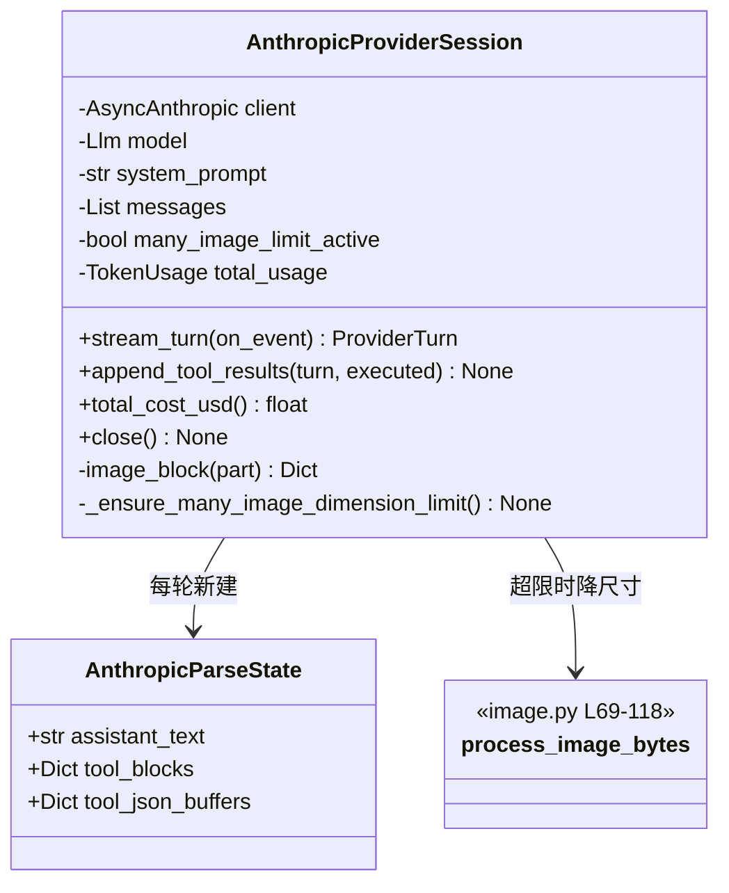

# `AnthropicProviderSession` 类职责分析

> 源码位置: `backend/agent/providers/anthropic/provider.py`、图像处理辅助 `backend/agent/providers/anthropic/image.py`

---

## 📋 **类作用**

Anthropic Messages API 适配器：Chat 消息转 Claude 格式（system 拆分 + 图片 base64 化），流式解析 content_block 事件，管理 adaptive thinking 档位与 20 图限流降尺寸，以 tool_result 内容块（含图片与 is_error 语义）回填。

---

## 🏗️ **类定义**



### 属性

| 属性 | 类型 | 访问 | 说明 |
|------|------|------|------|
| `_system_prompt` | `str` | private | 从消息[0]拆出的系统提示 |
| `_messages` | `List[Dict]` | private | Claude 格式会话容器（assistant/user 交替追加） |
| `_many_image_limit_active` | `bool` | private | 是否处于 >20 图的严格限流态（惰性判定+粘性） |

### 关键常量（provider.py:32-68）

| 常量 | 说明 |
|------|------|
| `ADAPTIVE_THINKING_MODELS` | 全部 Claude 模型走 adaptive thinking + effort 档位 |
| `ANTHROPIC_MODEL_CONFIG` | Llm 枚举 → api_name + effort 的显式映射（如 opus-5 × 5 档） |
| `CLAUDE_MANY_IMAGE_THRESHOLD=20` / `MAX_DIMENSION=2000`（image.py:45-46） | 超过 20 图触发 2000px 限流 |

---

## 🔍 **核心方法详解**

### `stream_turn()`（第 355-408 行）

**逻辑流程：**
```
stream_turn(on_event)
  │
  ├── _ensure_many_image_dimension_limit()   # 每次请求前重查（截图会累积）
  ├── 组参: model / max_tokens=50000 / system / messages / tools
  │     ├── cache_control = {"type": "ephemeral"}   # 提示词缓存
  │     └── 三分支思考配置:
  │           ├── ADAPTIVE 集 → thinking={"type":"adaptive"}
  │           │                 + output_config={"effort": 档位}
  │           ├── THINKING 集(空) → 预算式 thinking（当前未用）
  │           └── 其余 → temperature=0.0
  ├── async with client.messages.stream(...)
  │     └── async for event: _parse_stream_event(...)
  ├── final_message = await stream.get_final_message()
  ├── usage = _extract_anthropic_usage(final_message)
  └── return ProviderTurn(assistant_turn=final_message)  # 原生轮带回
```

**关键代码：**
```python
# provider.py:356-358 —— 为什么每次请求前都要重查
# Tool screenshots accumulate across turns. Re-check before every API
# call so crossing 20 images cannot leave earlier images above 2000 px.
self._ensure_many_image_dimension_limit()
```

**设计要点：** 工具截图跨轮累积——第 5 轮可能突然越过 20 图阈值；`_many_image_limit_active` 粘性置位后不再回查降档（只升不降，幂等）。

---

### `_convert_openai_messages_to_claude()`（第 141-185 行）

**作用**: 规范格式 → Claude 格式的静态转换。

**逻辑流程：**
```
deepcopy 消息 → messages[0] 拆出 system_prompt
  │
  ├── 统计 image_url 数量 > 20？
  │     └── 是 → 本批转换就用 max_dimension=2000（前置降尺寸）
  │
  └── for 每条消息的每个 image_url 分量:
        ├── data URL → process_image() 解码
        ├── 超限/超 5MB → PIL resize + JPEG 压缩（quality 95 起，每次 -5）
        └── 改写为 {"type":"image", "source":{"type":"base64",...}}
```

**设计要点：** 转换在**构造时一次**完成（初始图片）；后续轮次新增的工具图片走 `_image_block` 按需处理——两条路径共享 image.py 的同一套压缩逻辑。

---

### `_parse_stream_event()`（第 209-270 行）

**事件映射：**
```
content_block_start(tool_use) → 登记 tool_blocks[index] = {id, name}
content_block_delta:
  ├── thinking_delta → StreamEvent(thinking_delta)
  ├── text_delta     → StreamEvent(assistant_delta)
  └── input_json_delta → 累积 tool_json_buffers[index]
                        → StreamEvent(tool_call_delta, 累积串)
```

**设计要点：** Anthropic 的工具参数是 `partial_json` 增量，按 `event.index`（block 序号）分桶累积——与 OpenAI 的 call_id 键控不同但归一后无差别。

---

### `append_tool_results()`（第 445-494 行）

**逻辑流程：**
```
1. 组 assistant 轮: [text?] + 每个 tool_call 一个 tool_use 块 → _messages
2. 组 user 轮: 每个 executed 一个 tool_result 块
     ├── ok 且有图 → content = [text(JSON), 图片block...]（文本+图混排）
     ├── 失败       → content = 纯文本 JSON（API 禁止 is_error 带非文本）
     └── is_error = not ok
3. 追加后再次 _ensure_many_image_dimension_limit()  # 新图可能触发
```

**设计要点：** `is_error=True` 时 API 拒绝非文本 content——失败回退纯文本是**协议约束**而非选择；图片经 `_image_block`：公共 URL 用 url source（Anthropic 自取），本地 bytes 用 base64（超限态先降尺寸）。

---

### `process_image_bytes()`（image.py:69-118）

**作用**: Claude 视觉限制的统一处理器。

**决策树：**
```
图片 bytes 进入
  ├─ 尺寸 ≤ 限 且 base64 ≤ 5MB → 原样返回
  └─ 否则
       ├─ 长边 > 限 → PIL 等比缩放
       ├─ 转 RGB + JPEG quality=95
       └─ while 超 5MB 且 quality>10 → quality-=5 重存
```

**设计要点：** 模块 docstring（image.py:1-27）诚实记录了与官方文档的对齐与分歧（7990px 安全边距、JPEG 丢 alpha 对截图可接受、1568px 延迟建议）——少见的"文档级"适配注释。

---

## 🎨 **设计亮点**

1. **档位模型映射表**: `ANTHROPIC_MODEL_CONFIG` 把 15 个 Claude 枚举显式映射到 api_name+effort，与 `llm.py` 的枚举命名双轨一致——改档位只动表。
2. **20 图限流的三处收口**: 初始转换（构造时）、工具图片（`_image_block`）、每次请求前重查（`_ensure_*`）——覆盖图片进入会话的所有路径。
3. **错误语义双通道**: `is_error` 标志（API 层）+ JSON 里的 error 字段（内容层），模型两条路都能感知失败。

---

## 🔗 **与其他类的协作**

| 协作类 | 关系 | 协作方式 |
|--------|------|---------|
| `ProviderSession` | 实现 | 四协议方法 |
| `anthropic/image.py` | 依赖 | 压缩/降尺寸（process_image / process_image_bytes） |
| `AgentRunRecorder` / `PromptReportLogger` | 组合 | 同 OpenAI 侧 |
| `TokenUsage` | 依赖 | Anthropic 是唯一有 `cache_write` 的厂商 |

---

## 📊 **生命周期**

- **创建时机**: 工厂分支（model ∈ ANTHROPIC_MODELS 且 key 存在）。
- **使用场景**: `_messages` 随轮追加 assistant/user 对；`final_message` 作为 assistant_turn 原生传递。
- **销毁时机**: `close()` 打印用量并关闭 AsyncAnthropic。
