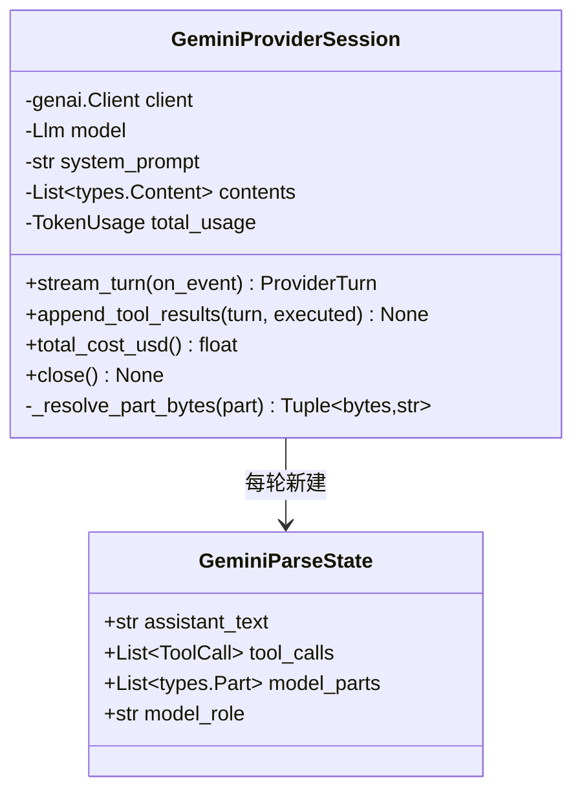

# `GeminiProviderSession` 类职责分析

> 源码位置: `backend/agent/providers/gemini.py`

---

## 📋 **类作用**

Google GenAI 适配器：Chat 消息转 `types.Content`（含视频/图片分辨率分级），流式解析 chunk 归一事件，**原样保留 model parts**（thought signature 续传必需），工具图片一律下载转内联 bytes。视频模式的唯一承载者。

---

## 🏗️ **类定义**



### 属性

| 属性 | 类型 | 访问 | 说明 |
|------|------|------|------|
| `_contents` | `List[types.Content]` | private | GenAI 原生会话容器（user/model 交替） |
| `_system_prompt` | `str` | private | 走 `system_instruction` 配置而非消息 |

### 关键常量与映射函数

| 名称 | 行号 | 说明 |
|------|------|------|
| `DEFAULT_VIDEO_FPS=10` | L29 | 视频 Part 的抽帧率 |
| `_get_gemini_api_model_name()` | L44-70 | 枚举 → api 名（3-flash-preview / 3.5 / 3.6 / 3.1-pro-preview） |
| `_get_thinking_level_for_model()` | L73-99 | 枚举后缀 → high/medium/low/minimal |
| `_detect_mime_type_from_base64()` | L113-133 | 魔数嗅探（PNG/JPEG/GIF/WEBP/MP4/WEBM） |

---

## 🔍 **核心方法详解**

### `_convert_message_to_gemini_content()`（第 166-207 行）

**作用**: 规范消息 → GenAI Content 的核心转换。

**逻辑流程：**
```
每条消息 → types.Content(role=user|model)
  │
  ├── 文本分量 → {"text": ...}
  └── 每个 image_url 分量:
        ├── data URL
        │     ├── mime 是 octet-stream → 魔数嗅探纠正（否则跳过并告警）
        │     ├── video/* → Part(inline_data, VideoMetadata(fps=10), HIGH)
        │     └── 图片   → Part.from_bytes(..., ULTRA_HIGH)   # 最高分辨率
        └── http URL → {"file_uri": url}   # Gemini 服务端自取
```

**关键代码：**
```python
# gemini.py:185-192 —— 视频 Part 的特殊构造
if mime_type.startswith("video/"):
    parts.append(types.Part(
        inline_data=types.Blob(data=media_bytes, mime_type=mime_type),
        video_metadata=types.VideoMetadata(fps=DEFAULT_VIDEO_FPS),
        media_resolution=types.PartMediaResolutionLevel.MEDIA_RESOLUTION_HIGH,
    ))
```

**设计要点：**
- 图片用 `MEDIA_RESOLUTION_ULTRA_HIGH` 而视频只到 `HIGH`——截图抠图需要像素级细节，视频抽帧则要控制 token 量。
- `assistant` → `model` 角色映射在这里完成。

---

### `_parse_chunk()`（第 244-292 行）

**事件映射：**
```
每个 chunk.candidates[0].content.parts:
  │
  ├── part.thought=True 且有 text → thinking_delta
  ├── part.function_call          → 立即产出完整 ToolCall（args 已是 dict）
  │                                 + tool_call_delta（同步预告）
  └── part.text                   → assistant_delta
  ※ 所有 part 无条件appendix进 model_parts
```

**关键代码：**
```python
# gemini.py:260-261 —— 为什么必须保留每个原生 part
# Preserve each model part as streamed so thought signatures remain attached.
state.model_parts.append(part)
```

**设计要点：** **thought signature** 是 Gemini 多轮思考的续传凭证——若回填时重建 Content 而不带原 part 的签名字段，下一轮思考会失效。这是 `assistant_turn` 必须用原生对象的最强理由（三家中的硬约束之最）。

---

### `append_tool_results()`（第 404-444 行）

**逻辑流程：**
```
1. 校验 assistant_turn 是 types.Content（不是则 ValueError）
2. contents.append(原生 model Content)      # thought signature 完整带回
3. 每个 executed:
     ├── multimodal_parts 逐个 _resolve_part_bytes
     │     ├── data bytes → 直接用
     │     └── 公共 URL   → httpx 下载（30s 超时，失败跳过并打印）
     └── FunctionResponse(id, name, response=结构化dict, parts=[inline图片...])
4. contents.append(Content(role="user", parts=tool_result_parts))
```

**设计要点：** Gemini 只收内联 bytes——与 OpenAI/Anthropic 可直传公共 URL 相反，`_resolve_part_bytes` 是本适配器独有的下载步骤（replicate.delivery 的图在这里被拉回本地再上传）。

---

### `_extract_usage()`（第 218-241 行）

**归一口径：**
```
input  = prompt_token_count - cached_content_token_count   # 扣缓存
output = candidates_token_count + thoughts_token_count     # 思考并入
cache_read = cached_content_token_count
```

---

## 🎨 **设计亮点**

1. **MIME 嗅探兜底**: 前端 FileReader 可能产出 `application/octet-stream` 的 data URL——魔数检测（PNG 头/JP2/RIFF-WEBP/ftyp/matroska）把错误标注纠正回来，纠正不了宁可跳过也不污染上下文。
2. **模型名/思考档映射集中**: 两个 `if` 链函数（L44-99）把 15 个枚举的 api 名与档位全部显式列出——和 Anthropic 侧的 CONFIG 表同构，加模型即加分支。
3. **视频一等公民**: fps 与分辨率的组合只出现在这个适配器——视频模式强制 Gemini 的架构原因由此可见。

---

## 🔗 **与其他类的协作**

| 协作类 | 关系 | 协作方式 |
|--------|------|---------|
| `ProviderSession` | 实现 | 四协议方法 |
| `httpx` | 依赖 | 工具图片 URL→bytes 下载 |
| `AgentRunRecorder` / `PromptReportLogger` | 组合 | 同前两家 |
| `prompts/create/video.py` | 上游 | 视频 data URL 以 image_url 形态进入消息，在此转换 |

---

## 📊 **生命周期**

- **创建时机**: 工厂分支（model ∈ GEMINI_MODELS 且 key 存在）。
- **使用场景**: `_contents` 跨轮累积；视频/图片输入只在首轮转换。
- **销毁时机**: `close()` 打印用量（genai.Client 无需显式关闭网络）。
