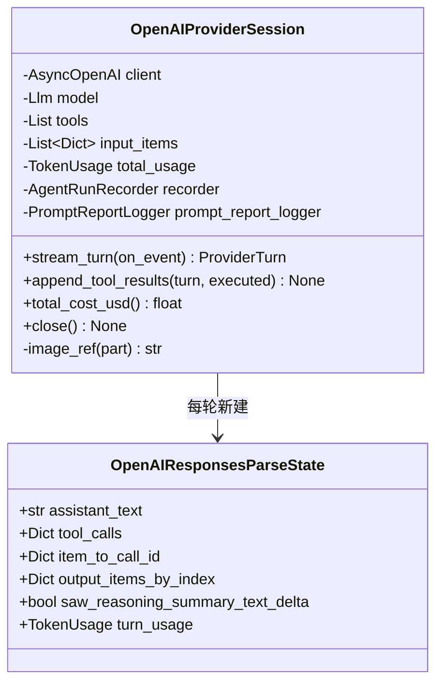

# `OpenAIProviderSession` 类职责分析

> 源码位置: `backend/agent/providers/openai.py`

---

## 📋 **类作用**

OpenAI Responses API 的协议适配器：把 Chat 格式提示词转成 Responses input，流式解析 Responses 事件状态机归一为 `StreamEvent`，strict 模式序列化工具 schema，并以 `function_call_output` 混排文本与图片回填工具结果。

---

## 🏗️ **类定义**



### 属性

| 属性 | 类型 | 访问 | 说明 |
|------|------|------|------|
| `_input_items` | `List[Dict]` | private | Responses 格式的会话容器（跨轮累积，append_tool_results 追加） |
| `_tools` | `List[Dict]` | private | 已 strict 化的函数 schema |
| `_total_usage` | `TokenUsage` | private | 跨轮累计计量 |
| `_prompt_report_logger` | `PromptReportLogger` | private | 每请求落盘 JSON 报告 |
| `state.*`（解析态） | — | — | 见 parse_state；item/call 双 ID 映射是 OpenAI 特有复杂度 |

### 方法

| 方法 | 参数 | 返回值 | 说明 |
|------|------|--------|------|
| `stream_turn()` | `on_event` | `ProviderTurn` | 组参数→记报告→流式消费→建轮（L444-478） |
| `append_tool_results()` | `turn, executed` | `None` | assistant items + function_call_output 追加（L496-534） |
| `total_cost_usd()` | — | `Optional[float]` | 按 api_name 查价（L480-484） |
| `close()` | — | `None` | TOKEN USAGE 日志 + client.close（L536-548） |
| `parse_event()`（模块级） | `event, state, sink` | `None` | 事件状态机（L173-363） |
| `_build_provider_turn()`（模块级） | `state` | `ProviderTurn` | 汇总 output_items→ToolCall（L365-416） |
| `_make_responses_schema_strict()`（模块级） | `schema` | `Dict` | strict 模式改造（L90-118） |

---

## 🔍 **核心方法详解**

### `stream_turn()`（第 444-478 行）

**作用**: 一轮完整请求。

**逻辑流程：**
```
stream_turn(on_event)
  │
  ├── 组参: model / input / tools / tool_choice=auto
  │     ├── max_output_tokens=50000
  │     ├── gpt-5.4-2026-03-05 → prompt_cache_retention="24h"
  │     └── reasoning = {"effort": 档位, "summary": "auto"}（若配置）
  ├── record_request（报告先落盘——请求失败也有记录）
  ├── recorder.record_llm_request
  ├── stream = await client.responses.create(**params, stream=True)
  ├── async for event: parse_event(event, state, on_event)
  ├── turn_usage → record_usage + accumulate
  └── return _build_provider_turn(state)
```

**设计要点：**
- gpt-5.5/5.6-sol/terra 的 image detail 用 `"original"` 而非 `"high"`（`_get_image_detail_for_model`，L58-65）——新模型原生分辨率不降采样。
- reasoning summary 的 `delta` 与 `part` 两种事件形态有去重状态（`saw_reasoning_summary_text_delta`）——只走一路，避免思考内容双发。

---

### `parse_event()` 事件状态机（第 173-363 行）

**作用**: 把 8+ 种 Responses 事件归一为三类 StreamEvent，并维护双 ID 映射。

**逻辑流程：**
```
事件类型                     → 动作
─────────────────────────────────────────────────────
response.created/completed  → completed 时提取 usage（扣 cached）
response.output_text.delta  → assistant_delta
reasoning_*_text.delta      → thinking_delta
reasoning_summary_part.*    → thinking_delta（仅 delta 路未走时）
output_item.added           → function/custom_tool_call: 建 tool_calls 条目
                               item_id ↔ call_id 双向登记
function_call_arguments     → .delta: 累积 arguments + 发 tool_call_delta
                               .done: 定稿 arguments
output_item.done            → 按 output_index 存完整 item
```

**关键代码：**
```python
# openai.py:240-245 —— item_id 与 call_id 冲突时的迁移
if item_id and item_id in state.tool_calls and item_id != call_id:
    existing = state.tool_calls.pop(item_id)
    state.tool_calls[call_id] = {**existing, "id": call_id}
```

**设计要点：**
- **双 ID 问题**: Responses API 同时有 `item.id`（fc_xxx）与 `call_id`（call_xxx），回填必须用 call_id——状态机全程维护映射并处理两 ID 先后到达的迁移。
- `_build_provider_turn` 优先用 `output_items_by_index`（官方完整 item），fallback 到自累积的 `tool_calls` 字典——两套数据源互为保险。

---

### `append_tool_results()`（第 496-534 行）

**作用**: 回填工具结果并附带图片。

```python
# openai.py:510-526 —— 文本+图片混排输出
if parts and executed.result.ok:
    output = [{"type": "input_text", "text": result_json}]
    for part in parts:
        image_url = self._image_ref(part)   # 公共URL直发 / 本地bytes转base64
        output.append({"type": "input_image", "detail": ..., "image_url": image_url})
```

**设计要点：** 结构化 JSON 文本在前、图片在后——模型同时拿到可解析数据与可看图像；失败调用（ok=False）不附图（ Responses 的输出项不带错误语义，模型靠 JSON 里的 error 字段感知）。

---

## 🎨 **设计亮点**

1. **strict schema 改造器**: `_make_responses_schema_strict` 递归补 `additionalProperties:false` / 全字段 required / 对象内数组 nullable——一次实现让 9 个工具全部满足 Responses strict 模式。
2. **两套 ID、两套数据源的防御性归一**: 状态机不是最优雅的，但是对 API 形态演进（function_call → custom_tool_call → mcp_call）逐个兼容的沉淀。
3. **用量口径修正**: OpenAI 把 cached 计入 input_tokens，`_extract_openai_usage`（L148-170）主动扣除——TokenUsage 的 `input` 恒为净输入。

---

## 🔗 **与其他类的协作**

| 协作类 | 关系 | 协作方式 |
|--------|------|---------|
| `ProviderSession` | 实现 | 四协议方法 |
| `AgentRunRecorder` | 组合 | record_llm_request/response 落 events.jsonl + SQLite |
| `PromptReportLogger` | 组合 | 每请求一 JSON 报告 |
| `TokenUsage` / `MODEL_PRICING` | 依赖 | 计量与计价 |
| `parse_json_arguments` | 依赖 | 定稿参数 JSON→dict，失败包 INVALID_JSON |

---

## 📊 **生命周期**

- **创建时机**: 工厂分支（model ∈ OPENAI_MODELS 且 key 存在）。
- **使用场景**: 一次 run 的所有轮次共用；`_input_items` 随轮增长。
- **销毁时机**: `close()` 打印用量并关闭 AsyncOpenAI 客户端。
