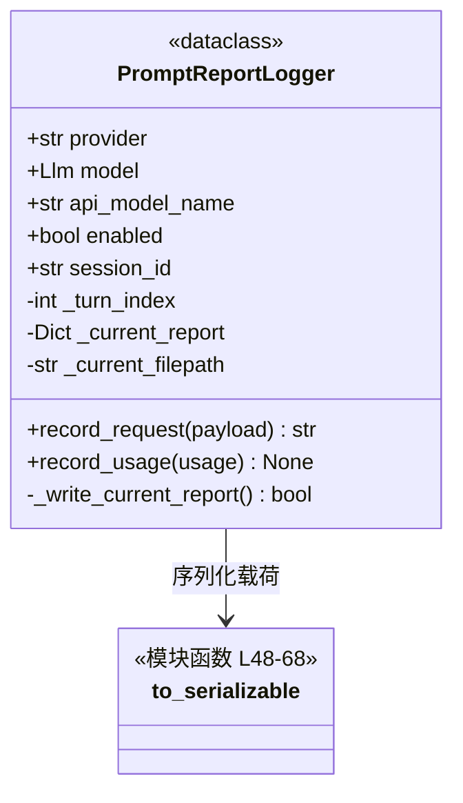
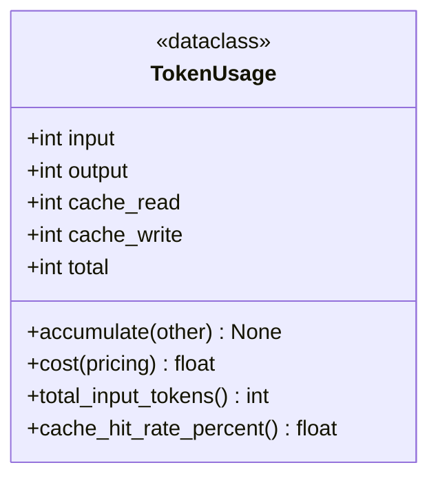
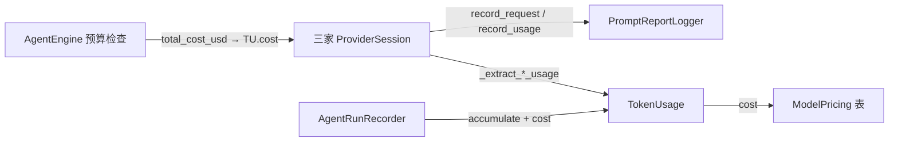

# `PromptReportLogger` 与 `TokenUsage` 类职责分析

> 源码位置: `backend/fs_logging/prompt_reports.py`、`backend/costs/token_usage.py`
> （两者体量小且同属"计量与报告"支撑层，合并一篇）

---

## 📋 一、`PromptReportLogger`

### 类作用

每个 Provider 会话一份的**逐请求 JSON 报告器**：请求发出前先写盘（失败也有现场），轮次结束后回写用量与成本。前端 `/evals/prompt-reports` 页直接浏览——QA.md 的第一条建议就是"信 prompt reports，别信 UI"。

### 类定义

### 方法

| 方法 | 行号 | 说明 |
|------|------|------|
| `record_request()` | L89-120 | turn+1，组报告（含完整 request 载荷）→ 写盘 → 返回路径 |
| `record_usage()` | L122-136 | 查价 → 回写 usage 块（含 cache_hit_rate、cost_usd）→ 重写文件 |
| `to_serializable()` | L48-68 | 递归降级：Pydantic model_dump(python 模式) / bytes→标准 base64 / Enum→值 |

### 设计要点

1. **先写后补**: `record_request` 在 API 调用**之前**落盘——请求崩溃也留有请求侧现场（provider.py:383 先 record 再 stream 的调用序）。
2. **base64 字母表陷阱**（to_serializable docstring L52-55）: Pydantic JSON 模式产出 URL-safe base64，会破坏 data: URL 在报告查看器里的渲染——所以强制 python 模式再手动标准 base64。
3. **文件名自描述**: `prompt_report_{日期}_{时间}_{session}_t{轮次}_{provider}_{model}.json`，目录列表即可定位（routes 侧只读尾部 2KB 抠 cost 做索引，避免整读多 MB 文件）。

### 生命周期

每个 ProviderSession 构造时创建（一次 run 一份，session_id 绑定），跨轮累计 turn；随会话关闭废弃。

---

## 📋 二、`TokenUsage`

### 类作用

跨厂商统一的 token 计量单位：五个整数 + 四个方法，把三家 API 各异的 usage 报文折叠成同一口径，是预算熔断（`cost()`）与缓存观测（`cache_hit_rate_percent()`）的计算基础。

### 类定义

### 字段口径（docstring L16-31，全系统唯一权威定义）

| 字段 | 口径 | 各家修正 |
|------|------|---------|
| `input` | **净输入**（不含 cache_read） | OpenAI/Gemini 从 prompt 数中扣除 cached |
| `output` | 输出（含思考） | Gemini 把 thoughts 并入；Anthropic 本就含 |
| `cache_read` | 缓存命中输入 | 三家都有 |
| `cache_write` | 缓存写入 | **仅 Anthropic**（ephemeral cache_control） |
| `total` | API 报的总量 | Anthropic 无此字段，自行求和 |

**恒等式**: 总输入 = input + cache_read + cache_write；成本 = (input×in + output×out + cache_read×cr + cache_write×cw) / 1e6。

### 方法

| 方法 | 行号 | 说明 |
|------|------|------|
| `accumulate()` | L40-45 | 逐字段累加——Session 跨轮、Recorder 跨调用都靠它 |
| `cost()` | L47-54 | 按百万 token 费率计价（ModelPricing 输入） |
| `cache_hit_rate_percent()` | L60-65 | cache_read / 总输入，零除保护 |

### 设计要点

1. **纯值对象**: dataclass 无 IO 无状态机——三家 Provider 的 usage 提取函数（`_extract_*_usage`）负责口径修正，本类只负责算术。
2. **成本语义托付给 pricing 表**: 未定价模型在调用侧表现为 `MODEL_PRICING.get() is None` → `total_cost_usd() 返回 None` → 预算熔断自动跳过——"不设限"是一等语义而非错误。
3. **叶子依赖纪律**: costs/ 包禁止 import agent/fs_logging/routes（`costs/__init__.py` 显式声明）——被全部上层共用而不反向依赖任何人。

---

## 🔗 协作总览

| 协作方 | 与两者的关系 |
|--------|-------------|
| ProviderSession ×3 | PromptReportLogger 的持有者；TokenUsage 的生产者 |
| `AgentEngine` | 经 `session.total_cost_usd()` 间接消费 `TokenUsage.cost` |
| `MODEL_PRICING` | pricing.py 的每百万费率表，按 **api 模型名**（非枚举）键控 |
