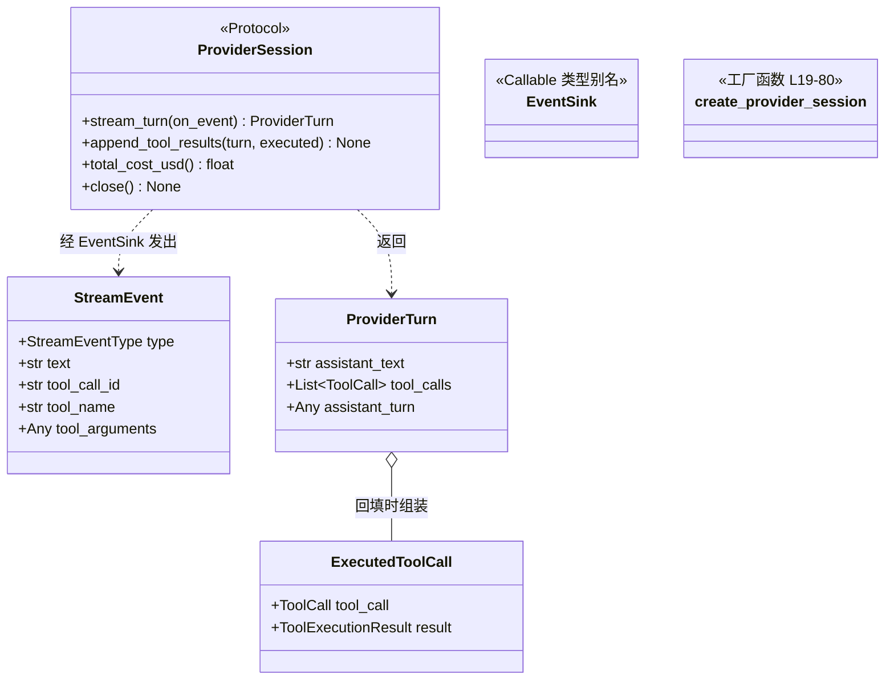

# `ProviderSession` 类职责分析

> 源码位置: `backend/agent/providers/base.py`（协议与数据类型）、`backend/agent/providers/factory.py`（工厂）

---

## 📋 **类作用**

LLM 交互层的**契约**：用 `typing.Protocol` 定义一次流式对话的四个能力（流式决策/结果回填/成本查询/收尾），配上三个跨厂商数据类型（流事件/轮次结果/执行记录）。引擎只认识这个协议，不知道背后是哪家模型。

---

## 🏗️ **类定义**



### 数据类型明细

**`StreamEventType`**（base.py:7-11）: `Literal["assistant_delta", "thinking_delta", "tool_call_delta"]` —— 整个系统只有这三类流增量。

### 属性

| 类型 | 字段 | 说明 |
|------|------|------|
| `StreamEvent` | `type / text / tool_call_id / tool_name / tool_arguments` | 前两类只填 text；tool_call_delta 填三个 tool_* 字段（arguments 可能是 str 累积或 dict） |
| `ProviderTurn` | `assistant_text / tool_calls / assistant_turn` | `assistant_turn` 是**厂商原生**的 assistant 轮对象——续会话必需（OpenAI 的 output_items / Anthropic 的 final_message / Gemini 的 Content），协议类型故意是 `Any` |
| `ExecutedToolCall` | `tool_call + result` | 引擎在 Phase 3 组装、Phase 4 整体交给 append_tool_results |

### 方法（协议四件套）

| 方法 | 参数 | 返回值 | 语义 |
|------|------|--------|------|
| `stream_turn()` | `on_event: EventSink` | `ProviderTurn` | 发起一轮流式请求，增量经回调吐出，结束后返回完整轮 |
| `append_tool_results()` | `turn, executed_tool_calls` | `None` | 把 assistant 轮 + 工具结果写回各自的原生会话容器 |
| `total_cost_usd()` | 无 | `Optional[float]` | 本会话累计花费；**None = 未定价模型不设限**（预算熔断的开关量） |
| `close()` | 无 | `None` | 打印 `[TOKEN USAGE]` 日志并关闭客户端 |

---

## 🔍 **核心方法详解**

### `create_provider_session()`（factory.py:19-80）

**作用**: 唯一的会话构造入口——能力门控 + 三路分支。

**逻辑流程：**
```
create_provider_session(model, prompt_messages, ...)
  │
  ├── canonical_tool_definitions(四个开关)
  │     ├── image_generation_enabled   ← 请求参数
  │     ├── image_editing_enabled      ← replicate key 存在（参数或 env）
  │     ├── asset_extraction_enabled   ← gemini key 存在 且 请求要求
  │     └── screenshot_enabled         ← is_screenshot_preview_available()
  │           └── 启动时探测缓存的 Chromium 可用性
  │
  ├── model ∈ OPENAI_MODELS   → AsyncOpenAI → OpenAIProviderSession
  ├── model ∈ ANTHROPIC_MODELS → AsyncAnthropic → AnthropicProviderSession
  ├── model ∈ GEMINI_MODELS   → genai.Client → GeminiProviderSession
  │     └── 各分支缺 key 即 raise（早失败）
  └── 都不属于 → ValueError("Unsupported model")
```

**关键代码：**
```python
# factory.py:31-39 —— 工具可见性的能力门控
canonical_tools = canonical_tool_definitions(
    image_generation_enabled=should_generate_images,
    image_editing_enabled=bool(replicate_api_key or REPLICATE_API_KEY),
    asset_extraction_enabled=should_extract_assets and bool(gemini_api_key),
    screenshot_enabled=is_screenshot_preview_available(),
)
```

**设计要点：**
- **模型归属显式化**: 分支判断用 `llm.py` 的 `MODEL_PROVIDER` 派生集合（OPENAI_MODELS 等），不靠名字前缀猜——加新模型只改映射表。
- 门控发生在**会话创建时**而非循环中——模型从第一轮起就只看到可用的工具，避免中途工具消失造成的混乱。

---

## 🎨 **设计亮点**

1. **Protocol 而非 ABC**: 结构化子类型——三家实现不需要（也确实没有）显式继承，测试可以用任意 duck-type 对象替身。
2. **`assistant_turn: Any` 的诚实**: 各家续会话的原生对象无法统一建模，协议承认这一点并用 `Any` 放行，把类型安全收窄到引擎真正依赖的两个字段（text/tool_calls）。
3. **EventSink 倒置控制**: Provider 不持有引擎引用，只拿一个异步回调——同一 ProviderSession 可以被引擎、评测器、回放器复用。
4. **成本查询而非成本上报**: `total_cost_usd()` 是拉取式——引擎决定何时检查（每轮工具后），Provider 内部自行累计。

---

## 🔗 **与其他类的协作**

| 协作类 | 关系 | 协作方式 |
|--------|------|---------|
| `AgentEngine` | 消费方 | `_run_with_session` 按协议四方法驱动 |
| `OpenAI/Anthropic/GeminiProviderSession` | 实现 | 三份独立实现，互不感知 |
| `CanonicalToolDefinition` | 输入 | 工厂门控后交各家的 `serialize_*_tools` 翻译 |
| `Llm` 枚举 | 输入 | `MODEL_PROVIDER` 集合决定分支 |
| `preview_screenshot` | 门控依赖 | `is_screenshot_preview_available()` 启动探测结果 |

---

## 📊 **生命周期**

- **创建时机**: `AgentEngine.run()` 内一次性创建（engine.py:336-353）。
- **使用场景**: 每轮 `stream_turn` + （有工具时）`append_tool_results`；跨轮持有原生会话容器实现上下文延续。
- **销毁时机**: run 的 `finally` 中 `close()`——无论成败必然执行。
