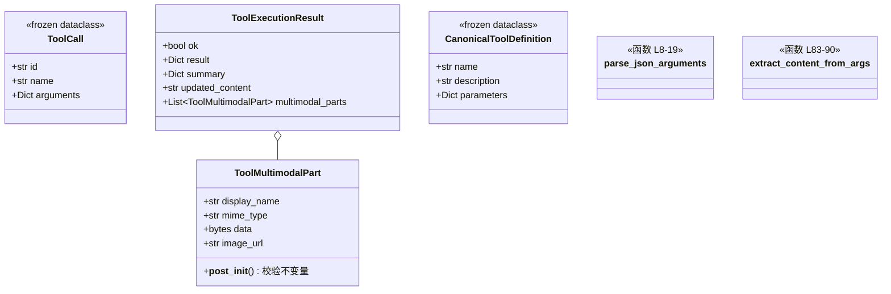

# `ToolCall` 工具数据类型族 职责分析

> 源码位置: `backend/agent/tools/types.py`（4 个数据类）、`backend/agent/tools/parsing.py`（解析函数）

---

## 📋 **类作用**

工具契约的**词汇表**：一次工具调用的请求形态（ToolCall）、执行结果形态（ToolExecutionResult）、结果内嵌图片的载体（ToolMultimodalPart）、厂商无关的工具定义（CanonicalToolDefinition），加上半成品 JSON 的流式解析函数——共同构成引擎与工具层之间的全部数据协议。

---

## 🏗️ **类定义**



### 字段说明

| 类 | 字段 | 说明 |
|----|------|------|
| `ToolCall` | `id/name/arguments` | 不可变；id 是 Provider 的 call_id 或生成回退 `tool-{hex6}` |
| `ToolExecutionResult` | `ok/result/summary/updated_content/multimodal_parts` | result 给模型（回填会话）；summary 给前端 UI（toolStart/toolResult 消息）；后两者可选 |
| `ToolMultimodalPart` | `data` 或 `image_url` 恰其一 | 构造即校验（见下） |

---

## 🔍 **核心机制详解**

### `ToolMultimodalPart.__post_init__()`（types.py:29-42）

**作用**: 在构造时强制不变量，把系统级约束挡在数据入口。

```python
# types.py:34-42
if (self.data is None) == (self.image_url is None):   # 恰好一个
    raise ValueError("requires exactly one of `data` or `image_url`.")
if self.image_url is not None and is_local_host_url(self.image_url):
    raise ValueError("must be publicly fetchable, got a localhost URL...")
```

**设计要点：** localhost URL 对 Anthropic/OpenAI 是静默失败（它们取不到）、只对 Gemini 的下载回退生效——与其让三家行为分叉，不如在数据结构层面一票否决，本地图必须走 `data` bytes。

---

### `_extract_partial_json_string()`（parsing.py:36-80）

**作用**: 流式预览的核心——从**不完整的 JSON 字符串**里抽出指定 key 的部分值。

**逻辑流程：**
```
输入: 累积的半成品 JSON 文本 + key（如 "content"）
  │
  ├── 找到 "key" 与其后的冒号、开引号
  ├── 扫描到"未转义的闭引号"或串尾
  │     └── 转义感知: 数反斜杠个数，偶数才算真闭引号
  ├── _strip_incomplete_escape: 尾部孤立的 \ 砍掉
  └── 尝试 json.loads 补全 → 失败则手动反转义 \n \t \" \\
```

**设计要点：**
- 这是 `create_file` 边生成边预览的基石——OpenAI/Anthropic 流式给的是累积 JSON 串，等定稿再显示就失去了"逐字成形"的体验。
- dict 输入（Gemini）直接 `.get(key)` 短路——两家形态统一在一个函数。

---

### `parse_json_arguments()`（parsing.py:8-19）

**归一规则**：dict 原样 / None→空 dict / 字符串 json.loads / 失败返回 `({}, error)`。Provider 在定稿时调用；失败时把原文包成 `{"INVALID_JSON": raw}` 由 runtime 前置拦截。

---

## 🎨 **设计亮点**

1. **frozen 数据类做边界**: ToolCall/CanonicalToolDefinition 不可变——调用一旦确定不被中途篡改，跨层传递零防御成本。
2. **result/summary 双轨**: 同一结果的两份投影（给模型的完整数据 vs 给 UI 的截断摘要），工具实现一次性产出，消费方各取所需。
3. **不变量即构造器**: ToolMultimodalPart 的两个校验把"localhost 陷阱"从运行时调试题变成构造时报错。

---

## 🔗 **与其他类的协作**

| 协作方 | 关系 | 协作方式 |
|--------|------|---------|
| `ProviderSession` 三实现 | 生产者 | 流式定稿后构造 ToolCall（parse_json_arguments） |
| `AgentEngine` | 消费者 | tool_call_delta 经 extract_*_from_args 做预览 |
| `AgentToolRuntime` | 消费者 | execute 的入参；ToolExecutionResult 的产出者 |
| `canonical_tool_definitions` | 生产者 | 9 个 CanonicalToolDefinition 实例（definitions.py:188-296） |

---

## 📊 **生命周期**

- 均为**值对象**：随用随建、无状态；ToolCall 在一轮内恒定，ToolExecutionResult 在工具执行瞬间创建后只读。
