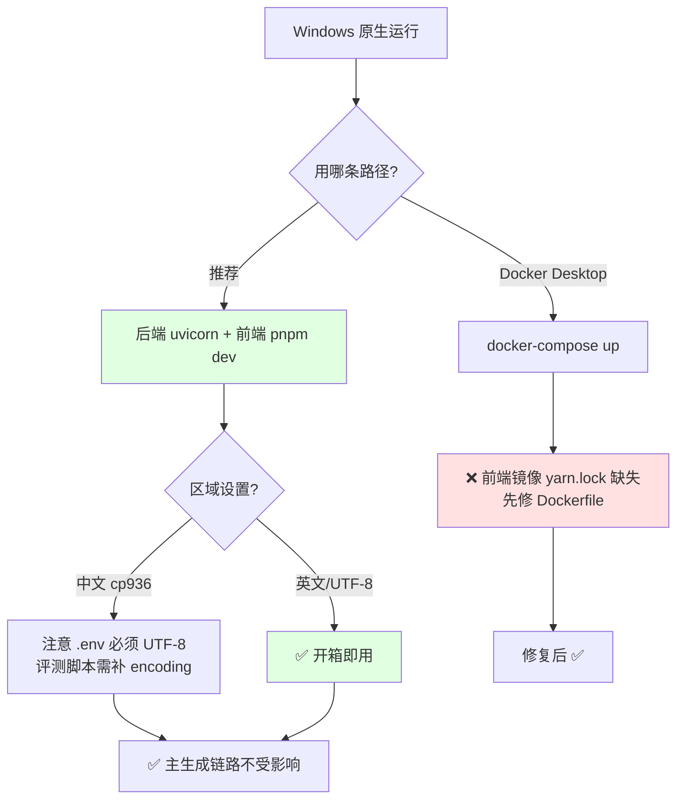

# screenshot-to-code - Windows 兼容性分析

> 生成时间: 2026-09-23
> 依据: windows-compat-checker.sh 脚本扫描（out/05-Windows兼容性检查.md）+ 全仓库源码逐项核查

## 总体评估

| 指标 | 结果 |
|------|------|
| 总体评级 | ⚠️ 部分兼容（核心开发/运行流程 ✅，个别路径需修复） |
| 高危问题 | 1（Docker 前端镜像，任何平台都失败，非 Windows 特有） |
| 中危问题 | 6 |
| 低危问题 | 4 |
| 已正确适配项 | 15+ |

### 评级说明

**核心结论**：后端（FastAPI + uvicorn）与前端（Vite/React）在 Windows 原生环境**可以正常安装、开发、测试和运行**，无任何阻塞性问题。风险集中在：

1. **中文/GBK 区域设置**下的编码问题（eval/调试路径的文本读写未显式指定 UTF-8）；
2. Docker 前端镜像的一个通用性构建错误；
3. 若干 bash 专属辅助脚本与测试命令语法。

主生成链路（WebSocket 管道 → Agent → 三家 LLM、素材提取、图片生成、截图自检）在 Windows 上完全可用。

## 1. 构建系统兼容性

### 1.1 package.json Scripts

| Script | 命令 | 问题 | 严重程度 |
|--------|------|------|----------|
| 根 `test` | `pnpm run test:frontend && pnpm run test:backend` | `&&` 在 pnpm 的 cmd shell 下可用 | ✅ 无问题 |
| 根 `test:backend` | `cd backend && poetry run pytest` | `cd backend &&` 在 pnpm cmd 下正常执行 | ✅ 无问题 |
| 前端 `test:qa` | `RUN_E2E=true TEST_ROOT_PATH=src/tests jest ...` | Unix 环境变量前缀语法，Windows cmd 下报 `'RUN_E2E' 不是内部或外部命令` | ⚠️ 中（仅 E2E 测试脚本） |

**修复建议**: 改用 `cross-env`（`cross-env RUN_E2E=true TEST_ROOT_PATH=src/tests jest src/tests/qa.test.ts`）或在 PowerShell 中以 `$env:RUN_E2E="true"; pnpm test:qa` 方式调用。

### 1.2 生命周期 Hooks

未发现生命周期 hooks（脚本扫描确认）。

### 1.3 构建工具链

| 工具 | Windows 支持 | 说明 |
|------|-------------|------|
| Python 3.10+ / Poetry | ✅ | README/AGENTS.md 均按跨平台方式编写 |
| uvicorn | ✅ | 纯 Python ASGI |
| Node + pnpm + Vite 6 | ✅ | `vite.config.ts` 用 `path.resolve`，无 shell 调用；`host: true` 可能触发一次防火墙授权弹窗 |
| Playwright | ✅ | Windows 完整支持，需 `poetry run playwright install chromium`；`--no-sandbox` 在 Windows 为 no-op |
| pillow / pillow-heif | ✅ | 官方提供 Windows wheel |
| moviepy | ✅（实为死依赖） | 全仓库无 import，**不需要 ffmpeg**（视频以 data URL 直传 Gemini） |

## 2. 源代码兼容性

### 2.1 child_process 调用

**无**。前后端源码零 `subprocess` / `os.system` / `os.popen` / `shell=True` / `/bin/bash` 匹配——应用不调用任何外部命令，这是 Windows 兼容性好的最大原因。

### 2.2 平台相关代码

**无**。全仓库无 `sys.platform` / `platform.system()` / `os.uname`（poetry.lock 中的匹配是依赖的环境标记，非代码）。uvloop 仅作为可选依赖出现在 lock 文件中，正确带有 `sys_platform != "win32"` 门控，Windows 上不会安装。

### 2.3 Unix 专用 API

| API | 文件 | 行号 | Windows 替代方案 |
|-----|------|------|-----------------|
| `SO_REUSEADDR`（端口探测） | `backend/start.py` | 9 | Windows 上该选项允许绑定**占用中**的端口 → `is_port_available()` 误报可用，uvicorn 启动报 `WinError 10048`。改用直接 `connect_ex` 探测或去掉该选项 |
| `/usr/share/fonts/truetype/dejavu`（字体路径） | `backend/evals/asset_extraction_benchmark.py` | 66 | 已有 `try/except OSError` + `ImageFont.load_default()` 优雅降级，仅影响评测可视化的字体美观，无需修复 |

无 `os.symlink` / `os.chmod` / `os.fork` / `signal.*` / `fcntl` / `os.geteuid` / `/tmp` 硬编码（临时目录正确使用 `tempfile.gettempdir()`，见 `backend/uploaded_assets/store.py:16`）。

## 3. 文件系统兼容性

### 3.1 路径处理

| 问题 | 文件 | 行号 | 说明 |
|------|------|------|------|
| 字符串拼接 `/`（可正常工作） | `backend/evals/runner.py` | 44 | `EVALS_DIR + "/inputs"`——Windows API 接受 `/`，功能不受影响，仅风格问题 |
| f-string 斜杠路径 + 空默认值 | `backend/debug/DebugFileWriter.py` | 15 | `IS_DEBUG_ENABLED=1` 且 `DEBUG_DIR=""` 时会在**当前盘根目录**（如 `D:\`）创建 uuid 目录。给 config.py 的 DEBUG_DIR 一个相对默认值即可 |

其余路径构造全部为 `os.path.join` / `pathlib`（config.py:29、fs_logging/、uploaded_assets/、evals/sets.py 等）——✅。

### 3.2 符号链接

未发现任何符号链接创建/依赖。

### 3.3 文件删除

| 问题 | 文件 | 行号 | 说明 |
|------|------|------|------|
| 裸 `os.remove()` 无异常保护 | `backend/routes/prompt_reports.py` | 197, 209 | Windows 上文件被占用（杀软扫描、并发读取）时删除抛 `PermissionError` → prune 端点 500。参照同项目 `routes/agent_runs.py:251` 的 `shutil.rmtree(..., ignore_errors=True)` 写法加 try/except |

## 4. Shell 和脚本兼容性

### 4.1 Shell 脚本

| .sh 文件 | 对应 .ps1 | 对应 .cmd | 说明 |
|----------|-----------|-----------|------|
| `scripts/cursor-cloud-install.sh`（#!/usr/bin/env bash，curl 装 Poetry + poetry/pnpm install） | ✗ 无 | ✗ 无 | 仅供 Cursor Cloud 环境；Windows 用户按 README 手动执行等效命令即可。另受 CRLF 风险影响（见 4.3） |

### 4.2 环境变量

| 变量/文件 | 问题 | 说明 |
|-----------|------|------|
| `backend/.env` 编码 | ⚠️ 已知并文档化 | 中文 Windows 记事本默认 ANSI/GBK 保存 → `load_dotenv()` 报 `UnicodeDecodeError`。README.md:112 已给出解法（Notepad++ 转 UTF-8） |
| `docker-compose.yml` `env_file: .env` | 低 | 根目录缺少 `.env` 时 `docker compose up` 直接报错（且 `version: '3.9'` 触发废弃告警） |

### 4.3 行尾符

| 问题 | 文件 | 说明 |
|------|------|------|
| `.gitattributes` 仅有 `* text=auto`，无 `*.sh text eol=lf` 规则 | `.gitattributes` | Windows 默认 `core.autocrlf=true` 时 `cursor-cloud-install.sh` 可能以 CRLF 检出，Git Bash 中报 `$'\r': command not found` |

**修复建议**: 在 `.gitattributes` 追加 `*.sh text eol=lf`。

## 5. 测试和 CI/CD 兼容性

### 5.1 CI 配置

无 CI 工作流（`.github/` 仅 FUNDING.yml 与 issue 模板）——无 CI 兼容性问题。pre-commit 钩子全部跨平台（check-yaml、check-added-large-files）。

### 5.2 测试覆盖

| 测试类型 | Windows 是否覆盖 | 说明 |
|----------|-----------------|------|
| 后端 pytest（40 文件） | ✅ 基本可跑 | 个别测试用 `open()`/`read_text()` 未指定 encoding 读 UTF-8 产物（`test_agent_runs.py:43,237,241,540`、`test_prompt_reports.py:49,68,85`），ASCII fixture 可过，非 ASCII 事件内容在 cp936 下会挂 |
| 前端 Jest 单测 | ✅ | 纯 Node，无平台问题 |
| 前端 E2E（puppeteer） | ⚠️ | 代码本身跨平台，但启动脚本 `test:qa` 的 Unix 环境变量语法在 cmd 下失败（见 1.1） |

## 6. 依赖兼容性

### 6.1 原生模块

| 依赖 | 是否需要编译 | Windows 支持 |
|------|-------------|-------------|
| pillow / pillow-heif | 否（wheel） | ✅ |
| playwright | 否（下载浏览器） | ✅ 需一次性 `playwright install chromium` |
| 其余（fastapi/httpx/openai/anthropic/google-genai 等） | 否 | ✅ 纯 Python |

### 6.2 可疑依赖

| 依赖 | 问题 | 替代方案 |
|------|------|----------|
| moviepy ^1.0.3 | 零 import 的死依赖（曾暗示需要 ffmpeg；现视频直传 Gemini） | 直接从 pyproject.toml 移除 |
| vitest（前端 devDeps） | 实际配置的是 Jest，vitest 未使用 | 移除或统一 |

## 7. 已正确处理的适配

| 适配项 | 文件 | 行号 | 处理方式 |
|--------|------|------|----------|
| 临时目录跨平台 | `backend/uploaded_assets/store.py` | 16 | `os.path.join(tempfile.gettempdir(), ...)` 而非 `/tmp` |
| 生产路径 UTF-8 写入 | `backend/fs_logging/agent_runs.py` | 324,798,853,960-966 | events.jsonl/run.json/final.html 全部 `encoding="utf-8"`，二进制 `"wb"` |
| Prompt 报告 UTF-8 | `backend/fs_logging/prompt_reports.py` | 143 | 同上 |
| HTTP 路由 UTF-8 读写 | `routes/agent_runs.py:186,209`、`routes/evals.py:97,161`、`routes/design_systems.py:71,100` | - | 显式 encoding |
| 设计系统原子写 | `backend/routes/design_systems.py` | 92-101 | `.json.tmp` + `Path.replace()` + utf-8 |
| 路径穿越防护 | `agent/tools/local_assets.py:50`、`evals/sets.py:298`、`routes/agent_runs.py:220` | - | 用 `os.sep` 感知的包含检查 |
| 事件循环策略 | （无需处理） | - | 未用 uvloop；Python 3.10+ 默认 Proactor 策略恰是 Playwright async 所需 |
| 上传元数据 ASCII 安全 | `backend/uploaded_assets/store.py` | 99,112 | `json.dump` 默认 `ensure_ascii=True`，hex/ASCII 载荷安全往返 |
| 截图工具优雅降级 | `backend/preview_screenshot/playwright_backend.py` | 43-58 | Chromium 缺失时捕获异常仅禁用工具 |
| 视频无需 ffmpeg | `backend/prompts/create/video.py` | 41 | 视频 data URL 直传 Gemini |
| API key 可经前端设置对话框 | `routes/generate_code.py` | 302-315 | 免改 .env 的跨平台配置途径 |

## 8. 修复建议

### 8.1 必须修复（HIGH）

1. **`frontend/Dockerfile:7`**: `COPY package.json yarn.lock /app/` 引用不存在的 `yarn.lock`（仓库用 pnpm，只有 pnpm-lock.yaml）→ **前端 Docker 镜像在任何平台（含 Windows Docker Desktop）都构建失败**，后续 `yarn install/yarn dev` 也与 `packageManager: pnpm` 矛盾。改为 `COPY package.json pnpm-lock.yaml /app/` + `corepack enable` + `pnpm install --frozen-lockfile` + `pnpm dev`。

### 8.2 建议修复（MEDIUM）

1. **编码统一**（中文 Windows 用户优先级最高）: 给以下位置补 `encoding="utf-8"`——
   - `backend/evals/runner.py:348`（写 LLM 生成的 HTML——**非 GBK 字符直接 UnicodeEncodeError，评测必挂**）、`:428`、`:443`；
   - `backend/routes/evals.py:465`（读评测输出 HTML）；
   - `backend/debug/DebugFileWriter.py:24`；
   - `backend/run_image_generation_evals.py:61,250-251`；
   - 测试 `test_agent_runs.py:43,237,241,540`、`test_prompt_reports.py:49,68,85`。
2. **`backend/start.py:9`**: 去掉 `SO_REUSEADDR`（Windows 下端口探测失真，导致 `WinError 10048` 启动失败）。
3. **`frontend/package.json` `test:qa`**: 引入 `cross-env` 替代 Unix 环境变量前缀。
4. **`backend/routes/prompt_reports.py:197,209`**: `os.remove` 加 try/except `PermissionError`（Windows 文件占用语义）。
5. **`.gitattributes`**: 追加 `*.sh text eol=lf`。

### 8.3 可选改进（LOW）

1. `backend/config.py:17`: `DEBUG_DIR` 默认空串改为 `./debug_output` 之类相对路径，避免 DebugFileWriter 在盘符根目录建目录。
2. 移除死依赖 moviepy / vitest（顺带缩小安装体积、消除 ffmpeg 误解）。
3. `docker-compose.yml`: 去掉过时的 `version: '3.9'`；文档注明需先创建根 `.env`。

## 9. Windows 原生运行快速路径（实操清单）

```powershell
# 1. 后端
cd backend
# 用 UTF-8 无 BOM 保存 .env（含 API key）
poetry install
poetry run playwright install chromium   # 可选
poetry run uvicorn main:app --reload --port 7001

# 2. 前端（新终端）
cd frontend
pnpm install
pnpm dev                                  # 打开 http://localhost:5173

# 3. 测试
cd backend; poetry run pytest             # 若个别用例因编码失败，见 8.2-1
cd frontend; pnpm test
```



## 10. 结论

该项目对 Windows 的友好度**好于多数同规模 AI Web 项目**：无外部进程调用、无 POSIX 专属系统调用、无事件循环黑魔法、生产路径 I/O 已显式 UTF-8、临时目录与路径构造规范。普通用户按 README 在 Windows 原生跑通核心功能（截图→代码、编辑、导出、截图自检）没有障碍；需要动手的是**中文区域设置下的评测/调试路径编码**（加 `encoding="utf-8"`，约 10 处一行改动）与**前端 Dockerfile 的 yarn/pnpm 错配**（若要用 Docker）。`test:qa` E2E 脚本与 `start.py` 端口探测是两处小修即可消除的隐患。
