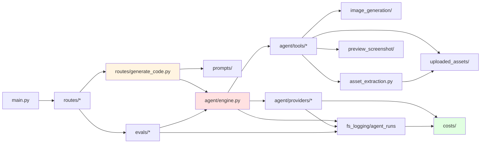

# screenshot-to-code - 架构分析

> 生成时间: 2026-09-23
> 依据: 脚本扫描（out/01~04）+ 核心源码阅读 + 前后端模块深度探索

## 1. 项目概览

### 1.1 项目信息

| 项目 | 内容 |
|------|------|
| 名称 | screenshot-to-code |
| 语言 | Python（后端 135 文件）+ TypeScript/React（前端 43+ 文件） |
| 类型 | AI 代码生成 Web 应用（前后端分离） |
| 描述 | 将截图、mockup、Figma 设计、屏幕录像转为干净可运行的前端代码。核心是一个带 9 种工具的多轮 Agent 循环，多模型变体并行竞速 |
| 许可 | MIT |
| 仓库 | github.com/abi/screenshot-to-code（本地为 fork: z_jordon） |

### 1.2 目录结构

```
screenshot-to-code/
├── backend/                     # FastAPI 后端（Poetry, Python ^3.10）
│   ├── main.py                  # 入口：.env 加载 + 路由注册 + startup 探测 Chromium
│   ├── start.py                 # 找可用端口启动 uvicorn（默认 7001）
│   ├── config.py                # 环境变量集中读取
│   ├── llm.py                   # Llm 枚举（41 个模型变体）+ 提供商映射
│   ├── custom_types.py          # InputMode = image|video|text
│   ├── asset_extraction.py      # Gemini 视觉检测 + 像素级裁剪提取素材
│   ├── babel_cdn.py             # 钉死 Babel CDN 版本（7.25.6）
│   ├── agent/                   # ★ Agent 核心
│   │   ├── engine.py            #   工具调用循环（≤30 轮、$3 熔断、流式预览）
│   │   ├── runner.py            #   Agent = AgentEngine 别名
│   │   ├── state.py             #   AgentFileState + 从历史播种
│   │   ├── providers/           #   base(Protocol)/factory + openai/anthropic/gemini
│   │   └── tools/               #   definitions（9 工具）/runtime/extract_assets/...
│   ├── prompts/                 # 提示词管线：plan→策略→create|update，6 种栈
│   ├── routes/                  # generate_code(WS 管道) + 9 个 HTTP 路由 + model_choice_sets
│   ├── ws/constants.py          # 自定义 WS 关闭码
│   ├── image_generation/        # Replicate 封装（z-image-turbo/flux-2-klein/p-image-edit）
│   ├── video/utils.py           # 视频 data-url 工具（本 fork 已简化，moviepy 为遗留依赖）
│   ├── preview_screenshot/      # 无头 Chromium 截图（Protocol + 注册表）
│   ├── uploaded_assets/         # 内容寻址素材存储（temp→promote 两段式）
│   ├── codegen/utils.py         # extract_html_content（剥离最终 HTML）
│   ├── costs/                   # 模型定价 + TokenUsage 统一计量（叶子包）
│   ├── fs_logging/              # AgentRunRecorder(events.jsonl+SQLite) / PromptReportLogger
│   ├── evals/                   # 评测系统（runner/sets/sessions/benchmark）
│   ├── debug/                   # IS_DEBUG_ENABLED 调试文件输出
│   └── tests/                   # 40 个测试文件（~262 用例）
├── frontend/                    # React 18 + Vite 6 + TS strict（pnpm）
│   └── src/
│       ├── App.tsx / main.tsx   # 编辑器主应用 + 路由（/ 与 8 个 /evals 页）
│       ├── generateCode.ts      # WebSocket 客户端（消息分发→store）
│       ├── store/               # zustand: app-store / project-store(核心文档模型)
│       ├── lib/                 # models/stacks/design-systems/prompt-history/babelCdn
│       ├── hooks/               # usePersistedState/useDesignSystems/useThrottle
│       └── components/          # preview(CodeMirror+iframe)/sidebar/unified-input/
│           #  recording/settings/history/variants/agent/evals/select-and-edit/commits/ui
├── scripts/cursor-cloud-install.sh
├── docker-compose.yml           # backend(7001) + frontend(5173)
├── AGENTS.md / TESTING.md / Evaluation.md / QA.md / Troubleshooting.md
└── design-docs/ blog/ plan.md
```

### 1.3 代码规模

| 统计 | 数量 |
|------|------|
| 后端 Python（非测试） | 95 文件 |
| 后端测试 | 40 文件（~262 用例） |
| 前端 TS/TSX | 115 文件 |
| 支持技术栈 | 6（html_css / html_tailwind / react_tailwind / bootstrap / ionic_tailwind / vue_tailwind） |
| 模型变体 | 41（Llm 枚举：GPT-5.4~5.6、Claude sonnet~fable、Gemini 3~3.6 × 推理档位） |

## 2. 架构设计

### 2.1 架构模式

整体为**前后端分离 + WebSocket 流式管道 + 插件式 Agent**的分层架构：

1. **表现层**（React SPA）—— zustand 单向数据流；WebSocket 消息 → store mutation → 视图响应。
2. **接口层**（FastAPI）—— 一个 WS 端点承载主流程（六层中间件责任链），9 个 HTTP 路由模块承载辅助能力。
3. **领域层**（agent/ + prompts/ + image_generation/ + asset_extraction.py）—— 与传输协议无关的生成领域逻辑。
4. **提供商抽象层**（agent/providers/）—— Protocol 统一三家 LLM SDK。
5. **基础设施层**（fs_logging/ + costs/ + uploaded_assets/ + preview_screenshot/）—— 可观测性、计费、存储、浏览器。

关键架构决策：

- **OpenAI 消息格式为内部规范格式**：提示词、会话状态一律用 `ChatCompletionMessageParam` 表达，转换下放到各 provider——新增厂商只需实现 `ProviderSession` Protocol。
- **服务端无状态**：对话历史由前端持有并回传；后端只在一次 WS 连接内维护 `PipelineContext`。跨实例水平扩展容易（设计系统是唯一的服务端持久数据，存 `~/.screenshot-to-code/design-systems.json`）。
- **观测永不打断主流程**：`AgentRunRecorder`/`PromptReportLogger` 全部方法自吞异常 + 开关门控。
- **评测与生产同链路**：`evals/core.py` 直接复用 `Agent` + 提示词构造，保证评测结论可迁移到线上（模型池选型即由此驱动，见 `model_choice_sets.py` 注释）。

### 2.2 核心模块

| 模块 | 职责 | 关键文件 |
|------|------|----------|
| WS 生成管道 | 参数校验→模型选择→提示词→并行变体→后处理 | `backend/routes/generate_code.py` |
| Agent 引擎 | ≤30 轮工具循环、流式预览、预算熔断、空输出保护 | `backend/agent/engine.py` |
| 提供商抽象 | 三家 LLM 统一 Protocol + 工具序列化 + 成本计量 | `backend/agent/providers/*` |
| 工具运行时 | 9 个 Agent 工具的定义与执行 | `backend/agent/tools/{definitions,runtime}.py` |
| 提示词管线 | 策略选择（create/update×history/snapshot）+ 6 栈模板 | `backend/prompts/{plan,pipeline,create/,update/}` |
| 素材提取 | Gemini 结构化检测 + PIL 像素级裁剪（HEIC 兼容） | `backend/asset_extraction.py` |
| 图片生成 | Replicate 轮询封装、批量并行 | `backend/image_generation/{replicate,generation}.py` |
| 截图自检 | 无头 Chromium 渲染自查（Protocol+注册表可替换） | `backend/preview_screenshot/*` |
| 上传素材 | sha256 内容寻址、temp→promote、SSRF 防护 | `backend/uploaded_assets/store.py` |
| 导出 | BeautifulSoup 收集资源→下载→重写→zip | `backend/routes/export.py` |
| 运行记录 | events.jsonl + SQLite 索引 + 自包含产物 | `backend/fs_logging/agent_runs.py`（968 行） |
| 成本 | 按模型定价表 + TokenUsage 统一三家口径 | `backend/costs/{pricing,token_usage}.py` |
| 评测 | 评测集/会话矩阵/重试/diff 模式 | `backend/evals/{runner,sets,sessions}.py` |
| 前端文档模型 | Commit/Variant 图、流式 mutation | `frontend/src/store/project-store.ts` |
| 前端 WS 客户端 | 消息协议分发→store | `frontend/src/generateCode.ts` |

### 2.3 架构图

```mermaid
graph TD
    subgraph Frontend["前端 React/Vite (5173)"]
        UI[组件层 preview/sidebar/settings/evals]
        Store[zustand project-store<br/>Commit/Variant 图]
        WSC[generateCode.ts WS 客户端]
    end

    subgraph FastAPI["后端 FastAPI (7001)"]
        WS[/generate-code WS/ --> Pipe[六层中间件管道]
        HTTP[9 个 HTTP 路由]
        Prompt[提示词管线 prompts/]
        Engine[AgentEngine]
        TR[AgentToolRuntime]
        Providers[Provider 工厂<br/>OpenAI|Anthropic|Gemini]
        Rec[AgentRunRecorder]
    end

    subgraph Infra["基础设施"]
        Assets[(素材存储<br/>sha256 内容寻址)]
        Logs[(run_logs/<br/>events.jsonl + SQLite)]
        DS[(design-systems.json)]
        Chrome[无头 Chromium]
    end

    subgraph External["外部服务"]
        LLM[LLM APIs]
        Replicate[Replicate]
        ScreenshotOne[ScreenshotOne]
    end

    UI <--> Store <--> WSC
    WSC <--> WS
    Pipe --> Prompt --> Engine
    Engine --> Providers --> LLM
    Engine --> TR
    TR --> Replicate
    TR --> Chrome
    TR --> Assets
    Engine --> Rec --> Logs
    HTTP --> DS
    HTTP --> ScreenshotOne
    HTTP --> Assets

    style Frontend fill:#e1f5ff
    style FastAPI fill:#fff4e1
    style Engine fill:#ffe1e1
    style External fill:#e1ffe1
```

## 3. 依赖关系分析

### 3.1 后端外部依赖（pyproject.toml）

| 依赖 | 版本 | 用途 |
|------|------|------|
| fastapi | ^0.115.6 | Web 框架（HTTP + WebSocket） |
| uvicorn | ^0.25.0 | ASGI 服务器 |
| websockets | ^14.1 | WS 协议（异常类型） |
| openai | 2.16.0（精确钉死） | OpenAI SDK + 消息类型作为内部规范 |
| anthropic | ^0.84.0 | Claude SDK |
| google-genai | ^1.16.1 | Gemini SDK |
| pillow / pillow-heif | ^10.3 / ^0.18 | 图像处理 / HEIC 支持 |
| httpx / aiohttp | ^0.28 / ^3.9 | 异步 HTTP（Replicate 轮询、资源下载） |
| beautifulsoup4 | ^4.12 | 导出时解析 HTML 收集资源 |
| playwright | ^1.61 | 无头 Chromium 截图自检 |
| pydantic | ^2.10 | Gemini 结构化输出 schema 等 |
| moviepy | ^1.0.3 | **遗留依赖**（本 fork 已无 import，见 3.3） |
| langfuse | ^3.0.2 | 可观测（依赖存在） |
| python-dotenv | ^1.0 | .env 加载 |
| pre-commit | ^3.6 | 代码钩子 |

开发依赖: pytest / pytest-asyncio / pyright（AGENTS.md 强制 pyright 零新告警）。

### 3.2 前端外部依赖（package.json 摘要）

| 类别 | 依赖 |
|------|------|
| 框架 | react 18 / react-dom / react-router-dom 6 |
| 状态 | zustand 4 |
| 编辑器 | codemirror 6 全家桶 + thememirror |
| UI | radix-ui 全家桶 + tailwindcss 3 + tailwindcss-animate（shadcn 风格） |
| 媒体 | html2canvas、webm-duration-fix（录屏时长修复） |
| 工具 | nanoid、classnames、copy-to-clipboard、react-dropzone、react-hot-toast、react-markdown、react-syntax-highlighter |
| 构建/测试 | vite 6、typescript 5、jest 29 + ts-jest、puppeteer 22（E2E）、eslint 8、vitest（在 devDeps 但实际配置的是 jest） |

### 3.3 模块依赖图（后端）



依赖纪律（显式约定）：

- `costs/__init__.py` 声明**禁止** import agent/fs_logging/routes（叶子包，防环）；
- `agent_runs.py` 为避免环选择复制而非 import engine 逻辑；
- `config.py` 必须在 `load_dotenv()` 之后导入（main.py 首行处理）。

### 3.4 依赖健康度

- 后端生产依赖: 18；开发依赖: 4。
- **过时/冗余项**:
  - `moviepy`——无任何 import（测试里还残留 mock），可移除；
  - `vitest` 与 `jest` 并存，实际只用 jest；
  - `langfuse` 在依赖中但主链路未见使用；
  - `openai` 钉死 2.16.0（有意为之，消息类型即接口）。
- 前端 `engines: node >= 14.18` 与实际工具链（Vite 6 需 Node 18+）不匹配，属声明过时。

## 4. 前端架构要点

（详细数据流见《运行机制分析》，此处补结构视角）

- **路由**: `/` 编辑器 + 8 个 `/evals/*` 评测页面（react-router）。
- **文档模型**: `project-store` 以 `Commit`（ai_create | ai_edit | code_create）为节点、`variants[]` 为并行世界、`head` 指针 + hash 索引构成版本图；已提交 Commit 不可变（守卫拒绝）。
- **流式渲染链**: WS 消息 → store mutation → `PreviewComponent` 以 200ms 节流写 `iframe.srcdoc`（经 `normalizeBabelCdn`）；变体缩略图独立节流。
- **无独立 api/ 目录**: HTTP 调用散布在 lib/design-systems、preview/download、unified-input/tabs/UrlTab、settings、evals 组件中，以 `HTTP_BACKEND_URL` 为基址。
- **开发代理**: Vite 将 `/generate-code`(ws)、`/api`、`/local-assets` 代理到 `PROXY_CODEGEN_BACKEND || http://127.0.0.1:7001`。

## 5. 数据与存储设计

| 数据 | 位置 | 形态 |
|------|------|------|
| 用户上传图片 | 系统临时目录 → `LOCAL_ASSET_DIR` | sha256 内容寻址 PNG，temp→promote 两段式 |
| 提取的素材 | `backend/local_assets/` | `asset_<sha256[:24]>.png`，`/local-assets` 静态服务 |
| Agent 运行记录 | `run_logs/` | events.jsonl + run.json + final.html + SQLite index.db |
| Prompt 报告 | `run_logs/prompt_reports/` | 每请求一个 JSON（尾部 2KB 索引避免整读） |
| 设计系统 | `~/.screenshot-to-code/design-systems.json` | tmp+rename 原子写 |
| 评测数据 | `backend/evals_data/`（inputs/outputs/sets） | manifest sha256 缓存 |
| 对话历史 | 浏览器（前端持有回传） | 无服务端会话 |

安全设计: 导出下载 SSRF 防护（`is_public_http_url`）、评测集路径穿越防护（realpath 包含检查 + 名称正则）、上传 20MB 上限 + MIME 白名单。

## 6. 测试架构

- **后端**: pytest + asyncio_mode=auto，40 文件与模块一一对应（provider 会话、引擎、工具、提示词、导出、评测、记录器……），重度 monkeypatch/mock 隔离外部服务。
- **前端**: Jest 单测覆盖 store/lib/组件纯逻辑；puppeteer E2E（`pnpm test:qa`，RUN_E2E 门控，页面内 mock WebSocket）。
- **回归资产**: `codegen/test_utils.py` 保留真实 LLM 输出样例做提取回归。
- **质量门**: AGENTS.md 要求每次改动跑 pytest + pyright（零新告警）+ 前端 lint。

## 7. 设计模式清单

| 模式 | 应用位置 |
|------|----------|
| 责任链/中间件 | WS 生成管道六层中间件（generate_code.py） |
| 策略 | 提示词构建策略（prompts/plan.py）、模型池选择 |
| 工厂 | create_provider_session（providers/factory.py） |
| Protocol（结构化接口） | ProviderSession、ScreenshotBackend |
| 注册表 + 可替换实现 | preview_screenshot/registry.py（set_screenshot_backend） |
| 观察者/记录器 | AgentRunRecorder / PromptReportLogger（永不失败） |
| 内容寻址存储 | uploaded_assets（sha256 文件名、去重） |
| 门面 | image_generation/core.py、preview_screenshot/__init__.py re-export |
| 数据类上下文 | PipelineContext / ExtractedParams / AgentFileState |

## 总结

screenshot-to-code 的架构成熟度高于典型"调一次 LLM"的同类项目：**Agent 工具循环 + 提供商 Protocol 抽象 + 评测驱动的模型选型**构成其质量护城河；**中间件管道、无状态服务端、内容寻址素材、永不失败的记录器**则体现了工程化考量。主要架构债是少量遗留依赖（moviepy、vitest）与前端 HTTP 调用分散无 api 层。对二次开发而言，最自然的扩展点都在第 2.2 节表格中的模块边界上（新增提供商/工具/栈/模型池均为局部改动）。
