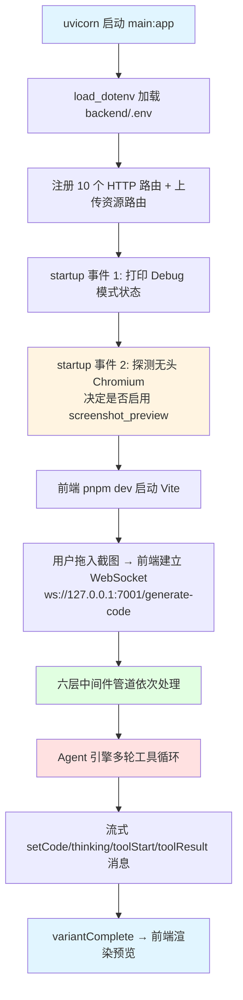
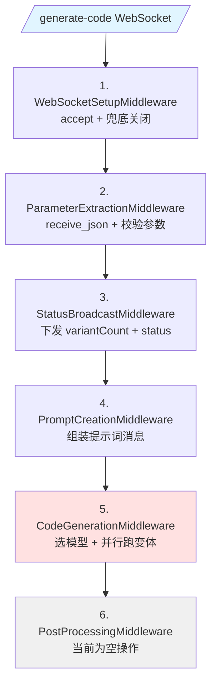
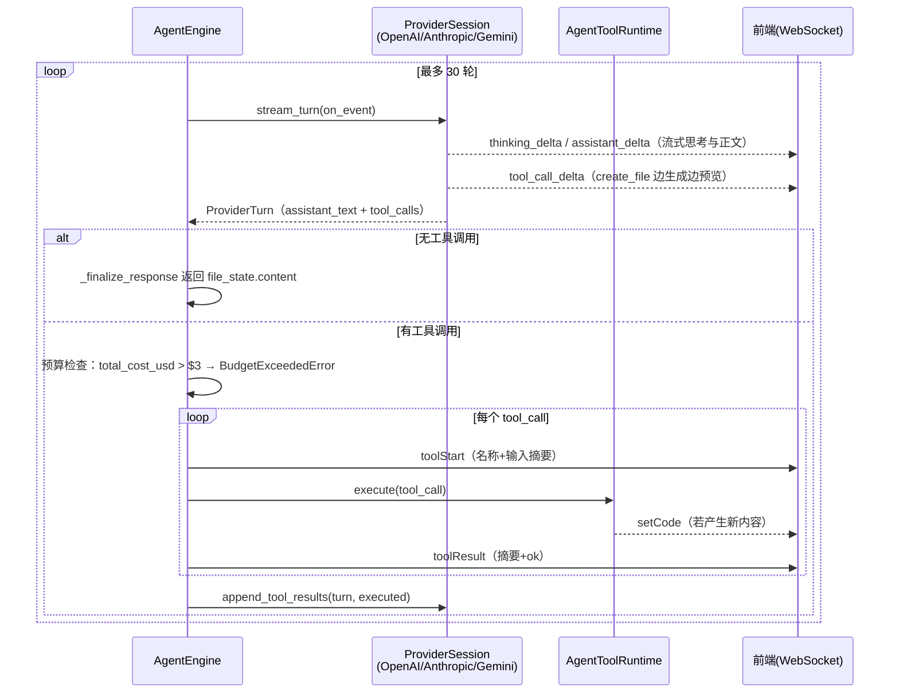
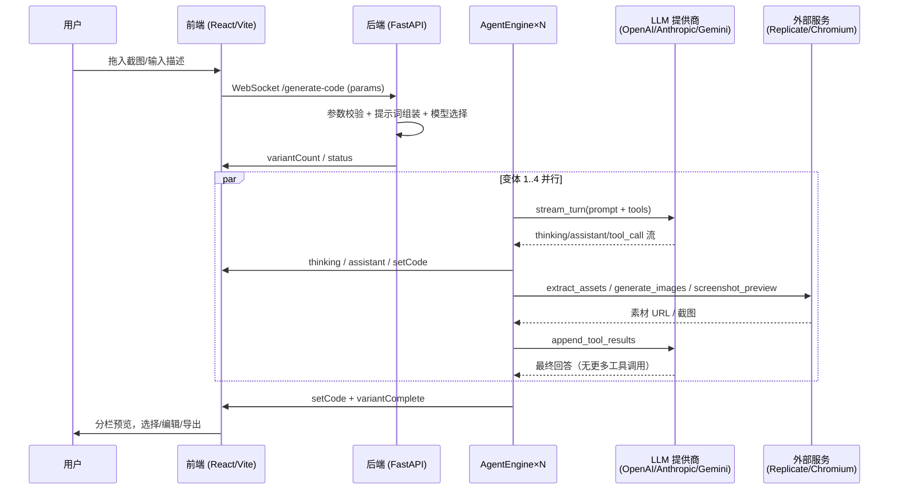
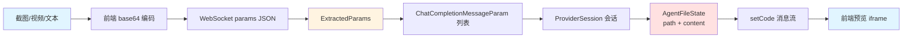
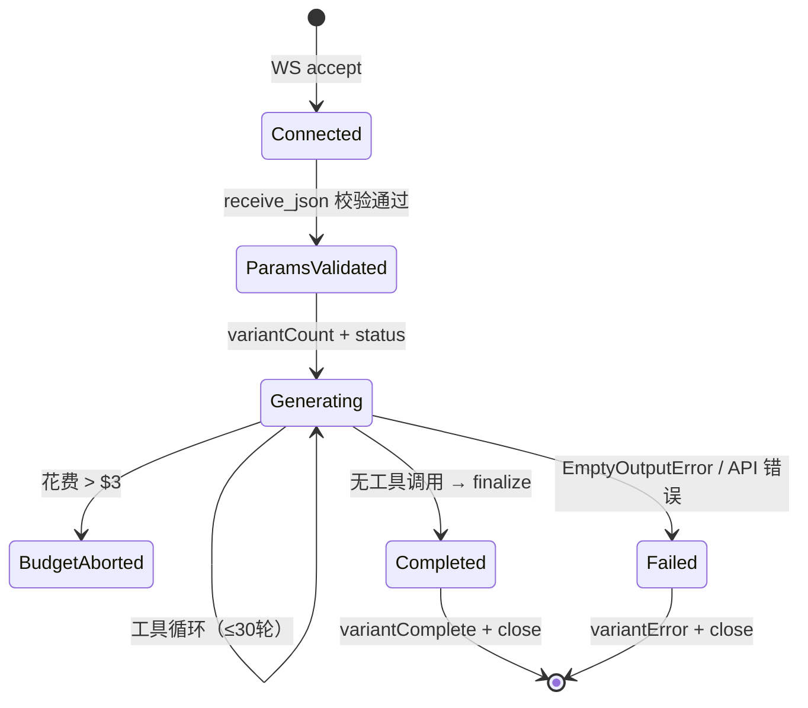
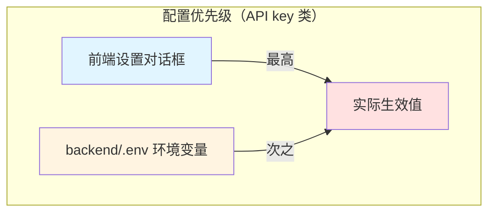
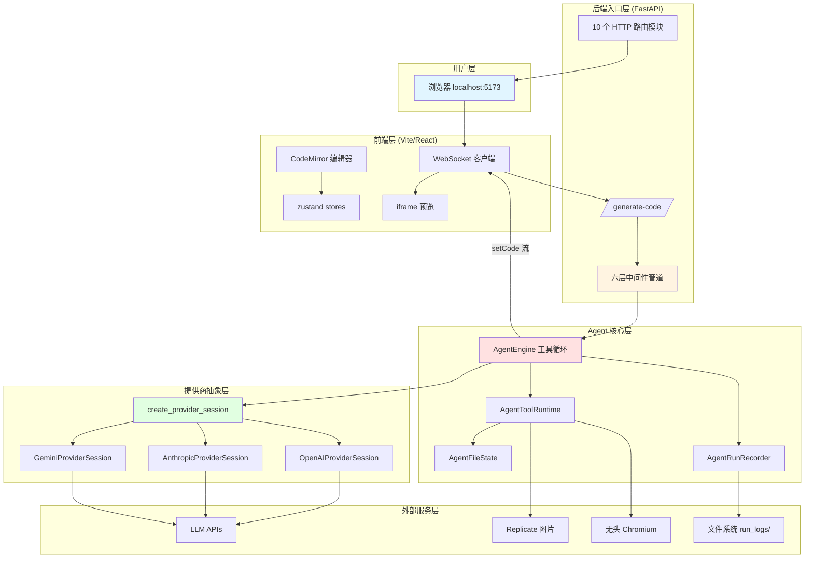

# screenshot-to-code - 运行机制详解

> 生成时间: 2026-09-23
> 分析依据: 脚本扫描（out/04-运行时分析.md）+ 核心源码阅读（backend/main.py、backend/routes/generate_code.py、backend/agent/ 全目录、backend/prompts/pipeline.py、backend/config.py）

## 一、项目运行方式

screenshot-to-code 是一个**前后端分离的 Web 应用**：

- **后端**：Python FastAPI 应用，通过 `uvicorn` 启动，同时提供 **HTTP 路由**（截图、导出、评估等）和 **WebSocket 端点**（代码生成主流程）。
- **前端**：React + Vite 单页应用，通过 WebSocket 与后端流式通信。

代码生成的核心不是"一次 LLM 调用"，而是一个**带工具调用能力的 Agent 循环**：模型可以创建文件、编辑文件、从截图中提取素材、生成/编辑图片、对自己生成的页面截图自检，多轮迭代后产出最终 HTML。

### 1. 安装与执行

```bash
# 后端（Poetry 管理）
cd backend
echo "OPENAI_API_KEY=sk-..." > .env          # 至少配一个模型 key
echo "GEMINI_API_KEY=..."       >> .env      # 强烈推荐（素材提取+视频模式）
echo "REPLICATE_API_KEY=r8_..." >> .env      # 推荐（图片生成/编辑）
poetry install
poetry run playwright install chromium       # 可选：截图自检工具
poetry run uvicorn main:app --reload --port 7001

# 前端（pnpm 管理）
cd frontend
pnpm install
pnpm dev                                     # http://localhost:5173

# 或 Docker 一键启动（仓库根目录）
echo "OPENAI_API_KEY=sk-..." > .env
docker-compose up -d --build
```

### 2. 执行流程（从进程启动到一次生成完成）



**入口文件**: `backend/main.py`

- `backend/main.py:1-4` — 最先执行 `load_dotenv()`，保证后续 `config.py` 读取到环境变量（导入顺序敏感：config.py 在 import 时即读取 os.environ）。
- `backend/main.py:24-25` — 创建 FastAPI 实例（关闭 openapi/docs），挂载上传资源路由。
- `backend/main.py:28-40` — 两个 `@app.on_event("startup")` 钩子：打印 Debug 状态；探测并预热无头 Chromium（`preview_screenshot.probe_screenshot_preview`），结果决定 `screenshot_preview` 工具是否对 Agent 可见。
- `backend/main.py:43-61` — CORS 全放开，注册 10 个路由模块。

## 二、核心运行机制

### 2.1 WebSocket 生成管道（责任链 / 中间件模式）

**位置**: `backend/routes/generate_code.py:887-901`（`stream_code` 端点）

**说明**: 前端连接 `/generate-code` 后，请求进入一个 6 层中间件管道。每层中间件实现 `Middleware.process(context, next_func)`（`generate_code.py:111-157`），通过 `Pipeline._wrap_middleware` 反向包装成洋葱链。共享状态由 `PipelineContext` 数据类携带（websocket、参数、提示词、各变体结果等，`generate_code.py:86-108`）。



**机制作用**:

- **关注点分离**: 参数校验（`ParameterExtractionStage`）、模型选择（`ModelSelectionStage`）、提示词组装（`PromptCreationStage`）、生成执行（`AgenticGenerationStage`）各自独立成 Stage 类，中间件只做编排。
- **健壮的 WebSocket 通信**: `WebSocketCommunicator`（`generate_code.py:160-250`）统一捕获 `ConnectionClosedOK/ConnectionClosedError/RuntimeError/WebSocketDisconnect`，客户端断开后置 `is_closed` 并静默丢弃后续消息，错误经 `throw_error` 以关闭码 `APP_ERROR_WEB_SOCKET_CODE`（定义于 `backend/ws/constants.py`）收口。
- **参数优先级**: API key 等配置遵循「前端设置对话框 > 服务端 .env」（`_get_from_settings_dialog_or_env`，`generate_code.py:395-408`）；生产环境（`IS_PROD`）禁用用户自定义 OpenAI 代理地址。

**WebSocket 消息协议**（`generate_code.py:42-55`，前端 ⇄ 后端）:

| 消息类型 | 方向 | 用途 |
|---|---|---|
| `variantCount` | 后端→前端 | 通告变体数量 |
| `status` | 后端→前端 | 状态文本（"Generating code..."） |
| `thinking` | 后端→前端 | 模型思考流（带 eventId 可累积） |
| `assistant` | 后端→前端 | 模型正文流 |
| `toolStart` / `toolResult` | 后端→前端 | 工具调用开始/结果（含输入摘要、ok 标志） |
| `setCode` | 后端→前端 | 全量替换当前变体代码（流式预览也走它） |
| `variantComplete` / `variantError` | 后端→前端 | 单个变体完成/失败 |
| `chunk` / `error` | 后端→前端 | 预留/全局错误 |
| 初始 JSON（params） | 前端→后端 | 栈、输入模式、key、history、fileState 等 |

### 2.2 变体并行与模型选择（策略模式）

**位置**: `backend/routes/generate_code.py:411-499`、`backend/routes/model_choice_sets.py`

**说明**: 每次生成会并行跑多个「变体」（variant）——同一提示词用不同模型各生成一版，前端左右分栏供用户对比挑选。

- 变体数量: **新建 4 个**（`NUM_VARIANTS=4`）、**编辑/更新 2 个**、**视频模式 2 个**（`backend/config.py:3-4`、`StatusBroadcastMiddleware`）。
- 模型池按「可用 API key 组合」选择: 三家 key 齐全时用 `ALL_KEYS_MODELS_DEFAULT/TEXT_CREATE/UPDATE`（按图片/文本/更新三种场景区分，由评测数据驱动刷新，注释见 `model_choice_sets.py:13-35`）；只有一家 key 时用对应单一池（`_get_variant_models`，`generate_code.py:451-499`）。
- 池内模型按取模循环填充变体槽位；**视频模式强制要求 Gemini key** 并固定使用 `VIDEO_VARIANT_MODELS`。
- `AgenticGenerationStage.process_variants`（`generate_code.py:589-611`）用 `asyncio.gather(..., return_exceptions=True)` 并发执行，单变体失败不影响其它变体；OpenAI 的认证/限流/模型不存在错误被翻译成用户友好的 `variantError` 文案。

### 2.3 Agent 工具调用循环（项目最核心机制）

**位置**: `backend/agent/engine.py:218-327`（`_run_with_session` / `run`）；`backend/agent/runner.py`（`Agent` 只是 `AgentEngine` 的别名子类）

**说明**: 每个变体由一个 `AgentEngine` 驱动。`run()` 先从提示词中提取输入图片、播种文件状态（`seed_file_state_from_messages`，从历史 assistant 消息或 system 消息的 "Here is the code of the app:" 标记恢复当前代码，`backend/agent/state.py:32-70`），再通过工厂创建 Provider 会话，进入最多 **30 轮** 的工具循环：



**关键子机制**:

- **流式代码预览**: `create_file` 的参数在流式 delta 阶段就被解析（`_handle_streamed_tool_delta`，`engine.py:170-216`），每累积约 40 字符即发一次 `setCode`，让用户在模型还没写完时就能看到页面逐步成形；工具执行完成后再做一次平滑分块回放（`_stream_code_preview`，`engine.py:146-168`）。
- **预算熔断**: 每轮工具调用前检查 `session.total_cost_usd()`，超过 `GENERATION_MAX_COST_USD = 3.0`（`backend/config.py:23`）即抛 `BudgetExceededError` 中止；未定价模型返回 None 不受限（`engine.py:267-276`）。最终轮（已产出答案）不再检查。
- **空输出保护**: `EmptyOutputError`（`engine.py:25-35`）——模型跑完工具却不写文件时按失败处理，防止空文件污染评测（对应提交 `91c400f`）。
- **运行记录**: `AgentRunRecorder`（`backend/fs_logging/agent_runs.py`）以 `generation_id + variant_index` 记录每次流事件、工具起止和最终结果；`except BaseException` 确保客户端断开（取消）也会把 run 落盘为 failed 而非悬挂在 running（`engine.py:354-373`）。
- **兜底收尾**: `_finalize_response`（`engine.py:375-386`）优先返回 `file_state.content`；若模型直接在正文里给了 HTML（没调 create_file），则用 `extract_html_content` 抽取并发送。

### 2.4 多提供商抽象（工厂 + 协议模式）

**位置**: `backend/agent/providers/factory.py`、`backend/agent/providers/base.py`

**说明**: `create_provider_session` 按 `Llm` 枚举所属厂商（`MODEL_PROVIDER` 映射表，`backend/llm.py:67-118`）创建对应会话。三个实现（`openai.py` / `anthropic/` / `gemini.py`）都满足 `ProviderSession` Protocol：

```python
class ProviderSession(Protocol):
    async def stream_turn(self, on_event: EventSink) -> ProviderTurn: ...
    async def append_tool_results(self, turn, executed_tool_calls) -> None: ...
    def total_cost_usd(self) -> Optional[float]: ...
    async def close(self) -> None: ...
```

统一事件流 `StreamEvent`（`assistant_delta` / `thinking_delta` / `tool_call_delta`，`base.py:7-21`）屏蔽了三家 SDK 的差异——引擎层完全不知道背后是哪家模型。工具定义也是先构建成厂商无关的 `CanonicalToolDefinition`，再由各家 `serialize_*_tools` 翻译成自家 schema。

**能力开关**（`factory.py:31-39`）决定给模型看哪些工具：无 Replicate key 就不提供 `edit_images`；无 Gemini key 不提供 `extract_assets`；Chromium 探测失败不提供 `screenshot_preview`。

### 2.5 工具运行时（Agent 可用的 9 个工具）

**位置**: `backend/agent/tools/definitions.py:188-297`（定义）、`backend/agent/tools/runtime.py`（执行）

| 工具 | 作用 | 启用条件 |
|---|---|---|
| `create_file` | 一次性写出完整 HTML 主文件 | 恒开 |
| `edit_file` | 精确字符串替换做增量编辑（支持批量 edits） | 恒开 |
| `generate_images` | 按提示词批量生成图片 URL | 图片生成开关 |
| `remove_backgrounds` | 批量去背景 | 恒定提供（无 key 时执行报错） |
| `edit_images` | 批量图片编辑/放大（并行独立编辑） | Replicate key |
| `extract_assets` | 用 Gemini 从截图裁剪真实素材（logo/图片） | Gemini key + 输入含静态图 |
| `screenshot_preview` | 无头浏览器渲染当前 HTML，回传桌面/移动截图自检 | Chromium 可用 |
| `save_assets` | 把用户上传的图片保存为可引用资源 | 恒开 |
| `retrieve_option` | 取回其它变体（选项）的完整 HTML 供参考 | 恒开 |

值得注意的是 `extract_assets` 的启用做了**双重防御**：视频输入虽然复用 `image_url` 消息形态但不是静态图，`_extract_input_images`（`engine.py:99-125`）只放行 `data:image/` 前缀的数据 URL。

### 2.6 提示词组装管线

**位置**: `backend/prompts/pipeline.py:12-53`

**说明**: `build_prompt_messages` 先用 `derive_prompt_construction_plan` 根据栈/输入模式/历史/文件快照推导构建策略，再分派到三条路径：

1. `update_from_history` — 多轮对话的续编辑，从 history 重建上下文；
2. `update_from_file_snapshot` — 前端传来了当前代码（`fileState`），在其上做增量修改；
3. 默认 `create` — 全新生成，按 `input_mode`（image/video/text，`backend/custom_types.py`）构造。

生成的 `Prompt` 是 OpenAI 兼容的消息列表（`ChatCompletionMessageParam`），同时被三家 Provider 复用。

## 三、完整工作流程

### 典型使用场景

#### 场景 1: 截图 → 代码（image 模式，新建）

1. 用户在 http://localhost:5173 拖入截图（可多张）→ 前端把图片转成 base64 数据 URL。
2. 前端连 `/generate-code`，发送 `generatedCodeConfig`（如 `html_tailwind`）、`inputMode: "image"`、图片、可选文本补充。
3. 管道选择模型池（如三家 key 齐全 → Opus 5 medium / 3-flash high / 3.1-pro high / sol max 四个变体）并行生成。
4. 每个变体里 Agent 典型动作序列：`extract_assets`（抠出截图里的真实 logo）→ `create_file`（流式写入 HTML）→ 可选 `generate_images`（补占位图）→ 可选 `screenshot_preview`（渲染自查、再 `edit_file` 修正）。
5. 前端四个分栏实时渲染各变体，用户挑一个进入下一步（编辑或导出）。

#### 场景 2: 录屏 → 原型（video 模式）

1. 用户上传 webm 屏幕录像（前端用 `webm-duration-fix` 修复时长元数据）。
2. 后端 `video/` 模块用 moviepy 抽帧成图片序列，作为多图输入。
3. 强制走 Gemini 双变体（`VIDEO_VARIANT_MODELS`），其余流程同上。

#### 场景 3: 迭代编辑（update 模式）

1. 用户在某个变体上追加文字指令（"把按钮改成蓝色"）。
2. 前端携带 `generationType: "update"` + 当前代码 `fileState` + 对话 `history`。
3. 提示词策略走 `update_from_file_snapshot`；只跑 2 个变体（省时省钱）；Agent 倾向用 `edit_file` 做精准替换而非重写全文件。

### 完整工作流序列图



## 四、数据流与状态管理

### 4.1 数据流转



### 4.2 关键数据结构

| 结构 | 用途 | 定义位置 |
|------|------|----------|
| `PipelineContext` | 管道全流程共享状态 | `backend/routes/generate_code.py:86` |
| `ExtractedParams` | 校验后的请求参数（栈/模式/keys/history/fileState） | `backend/routes/generate_code.py:253` |
| `Llm` (Enum) | 全部模型变体（含推理力度后缀） | `backend/llm.py:6` |
| `MODEL_PROVIDER` | 模型 → 厂商权威映射 | `backend/llm.py:67` |
| `AgentFileState` | Agent 的"文件系统"（单文件 path+content） | `backend/agent/state.py:9` |
| `StreamEvent` / `ProviderTurn` | 提供商统一事件与轮次结果 | `backend/agent/providers/base.py:15,23` |
| `CanonicalToolDefinition` | 厂商无关工具定义 | `backend/agent/tools/types.py` |
| `InputMode` | Literal["image","video","text"] | `backend/custom_types.py:4` |

### 4.3 状态管理

- **服务端无全局会话状态**: 所有状态存活于一次 WebSocket 连接内（`PipelineContext`）与一个变体的 `AgentEngine` 实例内；跨请求的"对话记忆"由前端持有 `history` 并随请求回传，服务端从中重建上下文。
- **Agent 文件状态**: `AgentFileState` 是唯一的可变产物；工具（create_file/edit_file）写它，`seed_file_state_from_messages` 从历史播种它，`_finalize_response` 从它读取最终 HTML。
- **前端状态**: zustand store 管理（详见《架构分析》前端章节）。



## 五、扩展机制

### 5.1 扩展点

| 扩展点 | 方式 | 位置 |
|--------|------|------|
| 新增 LLM 提供商 | 实现 `ProviderSession` Protocol + 在 factory 注册 + `MODEL_PROVIDER` 加映射 | `backend/agent/providers/factory.py:41-80` |
| 新增 Agent 工具 | 在 `canonical_tool_definitions` 加定义 + `AgentToolRuntime.execute` 加分支 | `backend/agent/tools/definitions.py:188` |
| 新增输出技术栈 | 扩展 `Stack` Literal + 添加对应提示词文件 | `backend/prompts/prompt_types.py` |
| 新增变体模型组合 | 调整 `model_choice_sets.py` 中的模型池（项目用评测驱动刷新） | `backend/routes/model_choice_sets.py` |
| 管道加处理阶段 | 实现 `Middleware` 并 `pipeline.use(...)` | `backend/routes/generate_code.py:888-898` |

### 5.2 钩子点

| 钩子 | 触发时机 | 用途 | 注册位置 |
|------|----------|------|----------|
| `log_debug_mode` | startup | 打印 Debug 开关状态 | `backend/main.py:28` |
| `probe_screenshot_preview_on_startup` | startup | 预热无头 Chromium，决定工具可用性 | `backend/main.py:34` |
| `on_event`（流式回调） | 每个 provider 流事件 | 录制 + 转发 thinking/assistant/tool 增量 | `backend/agent/engine.py:227` |

### 5.3 配置管理

配置全部来自**环境变量**（`backend/.env` 由 python-dotenv 加载），无配置文件层级；前端另有 `.env.local`（Vite 变量）。

| 变量 | 默认 | 作用 | 位置 |
|------|------|------|------|
| `OPENAI_API_KEY` / `ANTHROPIC_API_KEY` / `GEMINI_API_KEY` | None | 模型 key（至少一个；前端设置对话框可覆盖） | `backend/config.py:7-9` |
| `OPENAI_BASE_URL` | None | OpenAI 代理（须含 `/v1`；生产禁用） | `backend/config.py:10` |
| `REPLICATE_API_KEY` | None | 图片生成/编辑/去背景 | `backend/config.py:13` |
| `IS_DEBUG_ENABLED` / `DEBUG_DIR` | false / "" | 调试输出开关与目录 | `backend/config.py:16-17` |
| `PROMPT_REPORTS_ENABLED` | false | 每次 LLM 请求落盘 JSON 报告（`/evals/prompt-reports` 查看） | `backend/config.py:25` |
| `LOCAL_ASSET_DIR` / `LOCAL_ASSET_BASE_URL` | backend/local_assets / 127.0.0.1:7001 | 本地素材服务 | `backend/config.py:28-33` |
| `IS_PROD` | false | 托管版功能开关（禁用户代理等） | `backend/config.py:37` |
| `GENERATION_MAX_COST_USD` | 硬编码 3.0 | 单变体花费熔断 | `backend/config.py:23` |
| `VITE_WS_BACKEND_URL` / `VITE_HTTP_BACKEND_URL` | ws://127.0.0.1:7001 | 前端连接后端地址 | `frontend/.env.local` |



## 六、运行时架构总结



## 总结

screenshot-to-code 的运行机制围绕以下核心概念：

1. **WebSocket 中间件管道**: 代码生成请求经六层中间件（连接 → 校验 → 状态广播 → 提示词 → 生成 → 后处理）流转，`PipelineContext` 贯穿全程。
2. **多变体并行竞速**: 同一请求并行跑 2-4 个不同模型的变体，模型池由可用 API key 与场景（create/update/text）决定，用户对比择优。
3. **Agent 工具循环**: 生成不是单次调用而是最多 30 轮的 ReAct 式循环，模型通过 9 个工具（写文件/编辑/抠图/生图/修图/自检截图等）迭代逼近目标。
4. **提供商无关抽象**: `ProviderSession` Protocol + 统一 `StreamEvent` 流 + 规范化工具定义，让 OpenAI/Anthropic/Gemini 三家在引擎层无差别。
5. **流式体验工程**: thinking/assistant/tool 增量、create_file 参数级流式预览，把多轮 Agent 的等待拆成持续可见的进展。
6. **护栏与可观测性**: $3 预算熔断、空输出判失败、30 轮上限、`AgentRunRecorder` 全程落盘（客户端断开也能闭环）。

这种设计使项目既**保持了单一文件 HTML 产物的极简交付模型**，又**具备多模型对比、真实素材复用、自我视觉验证的工程化生成质量**，非常适合截图/Figma/录屏到可运行原型的快速转化场景。
